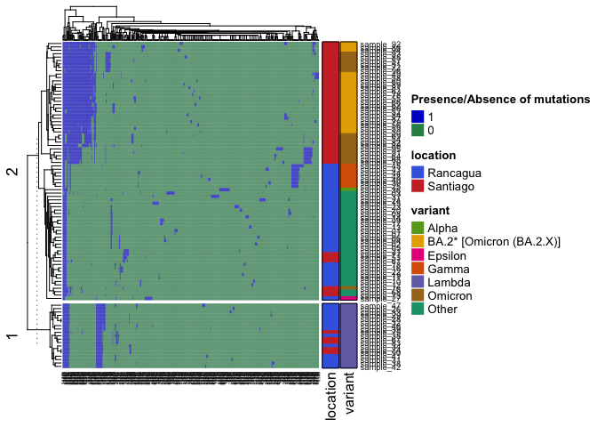
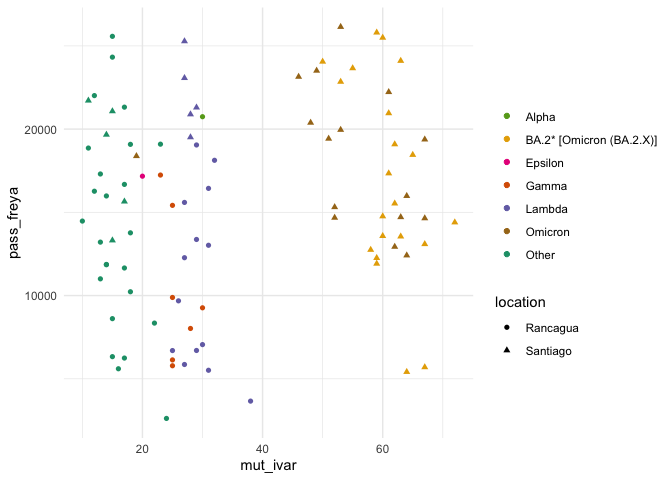
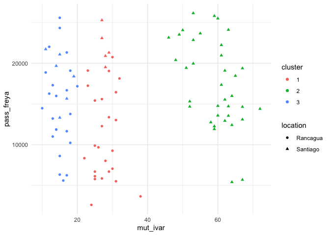
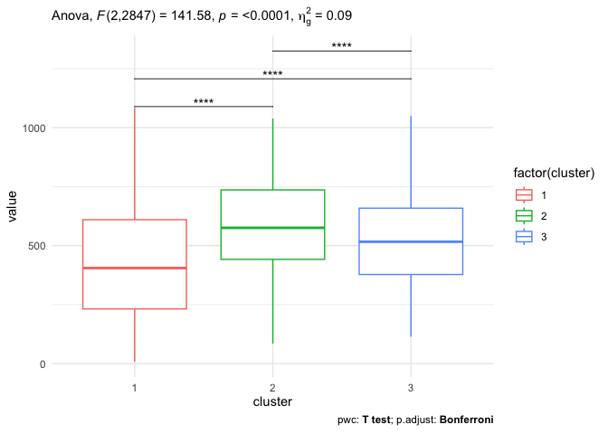
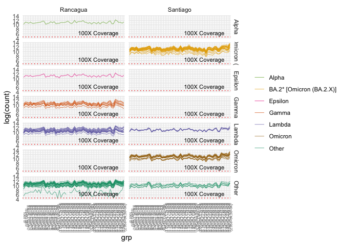

Analysis of COVID samples
================
2023-09-01

## Reading files

Reading results from iVar and freya from preprocessing output to
generated figures.

    ##    sampleId pass_freya mut_ivar variant location age analisis_data
    ## 1 sample_01       6330       15   Other Rancagua  28    2020-07-17
    ## 2 sample_02       8613       15   Other Rancagua  32    2020-08-04
    ## 3 sample_03       2618       24   Other Rancagua  44    2020-08-14
    ## 4 sample_04      25573       15   Other Rancagua  24    2020-08-19
    ## 5 sample_05      22013       12   Other Rancagua  56    2020-08-25
    ## 6 sample_06      16678       17   Other Rancagua  36    2020-09-02

## Results

### Mutation Heatmap

Using ComplexHeatmap library to plot if samples has 1 or any mutations
detected by iVar, using a binary matrix. Variant a location is also
included into the heatmap.

<!-- -->

### Number of variants vs heterogeneity

Combining mutations detected by iVar and variations in to positions
detected by Freya. Including variant information and location of
samples.

<!-- -->

## Heterogeneity between groups

In the previous there are three identifiable groups in the samples. Here
is the analysis to check if in every variant posible in the genome and
detected genes that are most mutated in the samples.

#### Groups:

Generate clusters trough kmeans with k = 3.
<!-- --> \### Staticistic
tests

First we check basics stats as mean and standard deviation

    ## Using X as id variables

    ## # A tibble: 3 × 5
    ##   cluster variable     n  mean    sd
    ##   <fct>   <fct>    <dbl> <dbl> <dbl>
    ## 1 1       value      900  428.  225.
    ## 2 2       value     1080  583.  193.
    ## 3 3       value      870  516.  193.

First, it performs an anova to check the effects of cluster labeling
into the variations in the genome position.

    ## ANOVA Table (type II tests)
    ## 
    ##    Effect DFn  DFd       F        p p<.05  ges
    ## 1 cluster   2 2847 141.578 2.41e-59     * 0.09

Then to compare difference between groups it performs a t-test

    ## # A tibble: 3 × 10
    ##   .y.   group1 group2    n1    n2        p method    p.adj p.signif p.adj.signif
    ## * <chr> <chr>  <chr>  <int> <int>    <dbl> <chr>     <dbl> <chr>    <chr>       
    ## 1 value 1      2        900  1080 1.30e-60 T-test 3.91e-60 ****     ****        
    ## 2 value 1      3        900   870 1.89e-19 T-test 5.68e-19 ****     ****        
    ## 3 value 2      3       1080   870 8.61e-13 T-test 2.58e-12 ****     ****

Now we plot the data in a boxplot, showing anova result and t-test.
<!-- -->

## Samtools depth

Checking depth of the samples and separate them by variant and location.

    ## `summarise()` has grouped output by 'sampleId', 'grp', 'location'. You can
    ## override using the `.groups` argument.

### Samtools depth plot

    ## Warning: Using `size` aesthetic for lines was deprecated in ggplot2 3.4.0.
    ## ℹ Please use `linewidth` instead.
    ## This warning is displayed once every 8 hours.
    ## Call `lifecycle::last_lifecycle_warnings()` to see where this warning was
    ## generated.

<!-- -->
