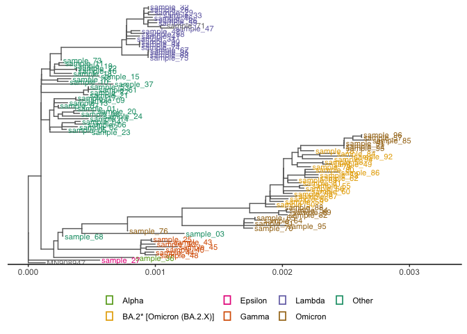
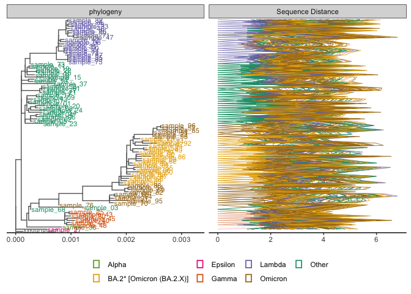

Analysis of COVID samples
================
2023-09-27

## Reading files

Reading results from iVar and freya from preprocessing output to
generated figures.

    ##    sampleId pass_freya mut_ivar variant location age analisis_data cluster
    ## 1 sample_01       6330       15   Other Rancagua  28    2020-07-17       3
    ## 2 sample_02       8613       15   Other Rancagua  32    2020-08-04       3
    ## 3 sample_03       2618       24   Other Rancagua  44    2020-08-14       1
    ## 4 sample_04      25573       15   Other Rancagua  24    2020-08-19       3
    ## 5 sample_05      22013       12   Other Rancagua  56    2020-08-25       3
    ## 6 sample_06      16678       17   Other Rancagua  36    2020-09-02       3

## Results

### Mutation Heatmap

Using ComplexHeatmap library to plot if samples has 1 or any mutations
detected by iVar, using a binary matrix. Variant and location is also
included into the heatmap.

    ## quartz_off_screen 
    ##                 2

### Number of variants vs heterogeneity

Combining mutations detected by iVar and variations in to positions
detected by Freya. Including variant information and location of
samples.

<!-- -->

## Heterogeneity between groups

In the previous there are three identifiable groups in the samples. Here
is the analysis to check if in every variant posible in the genome and
detected genes that are most mutated in the samples.

#### Groups:

Generate clusters trough kmeans with k = 3.
<!-- --> \### Staticistic
tests

First we check basics stats as mean and standard deviation

``` r
pos_variant <- read.table('pos_variants.csv', h=TRUE,sep=",")
pos_variant <- melt(pos_variant)
```

    ## Using X as id variables

``` r
pos_variant <-  left_join(pos_variant, all_results, by = c("variable" = "sampleId")) %>%
  select(contains(c('X', 'variable', 'value','cluster','variant','location','cluster')))

pos_variant %>%
  group_by(cluster) %>%
  get_summary_stats(value, type = "mean_sd")
```

    ## # A tibble: 3 × 5
    ##   cluster variable     n  mean    sd
    ##   <fct>   <fct>    <dbl> <dbl> <dbl>
    ## 1 1       value      900  428.  225.
    ## 2 2       value      870  516.  193.
    ## 3 3       value     1080  583.  193.

First, it performs an anova to check the effects of cluster labeling
into the variations in the genome position.

``` r
#primer approach
res.aov <- pos_variant %>% anova_test(value ~ cluster)
res.aov
```

    ## ANOVA Table (type II tests)
    ## 
    ##    Effect DFn  DFd       F        p p<.05  ges
    ## 1 cluster   2 2847 141.578 2.41e-59     * 0.09

Then to compare difference between groups it performs a t-test

``` r
pwc <- pos_variant %>%
  pairwise_t_test(value ~ cluster, p.adjust.method = "bonferroni", detailed = TRUE)
pwc
```

    ## # A tibble: 3 × 10
    ##   .y.   group1 group2    n1    n2        p method    p.adj p.signif p.adj.signif
    ## * <chr> <chr>  <chr>  <int> <int>    <dbl> <chr>     <dbl> <chr>    <chr>       
    ## 1 value 1      2        900   870 1.89e-19 T-test 5.68e-19 ****     ****        
    ## 2 value 1      3        900  1080 1.30e-60 T-test 3.91e-60 ****     ****        
    ## 3 value 2      3        870  1080 8.61e-13 T-test 2.58e-12 ****     ****

``` r
pwc <- pwc %>% add_xy_position(x = "cluster")
```

Now we plot the data in a boxplot, showing anova result and t-test.
<!-- -->

## Samtools depth

Checking depth of the samples and separate them by variant and location.

``` r
samtools_results <-read.table('samtools_depth.csv', h=TRUE,sep=",")
samtools_results <- melt(samtools_results, id="X")
colnames(samtools_results) <- c('pos', 'sampleId', 'depth')

samtools_results <- left_join(samtools_results,all_results[c('sampleId', 'location', 'variant')], by="sampleId")
samtools_results<-samtools_results[!grepl("71", samtools_results$sample),]

samtools_results <- samtools_results %>% group_by(location, variant)

samtools_results <- samtools_results %>% group_by(location, variant) %>%
  mutate(med = mean(depth, na.rm = TRUE))

samtools_depth_range <- samtools_results %>%
  group_by(sampleId, grp = cut(pos, breaks=pretty(pos, n = 60), dig.lab = 5), location, variant, med) %>% 
  summarise(count = mean(depth, na.rm = TRUE))
```

    ## `summarise()` has grouped output by 'sampleId', 'grp', 'location', 'variant'.
    ## You can override using the `.groups` argument.

### Samtools depth plot

    ## Warning: Using `size` aesthetic for lines was deprecated in ggplot2 3.4.0.
    ## ℹ Please use `linewidth` instead.
    ## This warning is displayed once every 8 hours.
    ## Call `lifecycle::last_lifecycle_warnings()` to see where this warning was
    ## generated.

<!-- -->

## Phylogenetic tree

Analysis of phylogeny of samples from results of iqtree and plotted with
ggtree. We use as inspiration this figure
<https://yulab-smu.top/treedata-book/chapter13.html>, and added the
sequences distance to the tree.

### Processing tree data

First, is necessary to transform tree data into a tiblle to add variant
information from samples, after that it returns to treedata object.

``` r
my_tree <- read.newick('../Phylogenetics/iqtree2.treefile')
#transforming tree to add variant information
x <- as_tibble(my_tree)
#formatting sample name
x$sampleId <- paste0('sample_',(str_extract(x$label,"(?<=-)\\d+")))
#keeping name of reference
x <- x %>% 
  mutate(sampleId = ifelse(label == 'MN908947',label,sampleId))
#joining data
x_new <- treeio::full_join(x,all_results[c('sampleId', 'location', 'variant')], by="sampleId")
#transforming data into a tree object again!
x_new <- as.treedata(x_new)
```

#### First sight to phylogenetic tree

``` r
#plot tree
p7 <- ggtree(x_new, color="grey40", ladderize = TRUE) +
  xlim_tree(0.00325) +
  geom_tiplab(aes(color=variant, label = sampleId), size=3.) +
  scale_color_manual('', values = variant) +
  guides(color = guide_legend(override.aes = list(size = 5, label = "\u25AA")))+
  theme_tree2(legend.position = "bottom")

p7
```

<!-- -->

### Calculate distance

This is do it with MUSCLE package of R, the code is commented by the
moment because it takes a lot of time to calculated, but we have
alignment already saved.

#### Transforming data to be ready to plot

Is necessary to formatting data to plot and joined into the tree.

``` r
#reading alignment file from MUSCLE
tipseq_aln <- readDNAStringSet("../Phylogenetics/samples_alignment.fasta")
tipseq_aln <- DNAStringSet(tipseq_aln)
#calculating distance between sample
tipseq_dist <- stringDist(tipseq_aln, method = "hamming")
## calculate the percentage of differences
tipseq_d <- as.matrix(tipseq_dist) / width(tipseq_aln[1]) * 100

## convert the matrix to a tidy data frame for facet_plot
dd <- as_tibble(tipseq_d)
dd$seq1 <- rownames(tipseq_d)
td <- gather(dd,seq2, dist, -seq1)
# with this we can save colors from tree
g <- p7$data$variant
names(g) <- p7$data$label
td$clade <- g[td$seq2] 

#this sample is deleted due to low coverage 
td<-td[!grepl("03-03", 
              c(td$seq1)),]
td<-td[!grepl("03-03", 
              c(td$seq2)),]

#adding a new column to set further order of apperance in the graph and to make that omicron variants keep together
td <- td %>%
  mutate( alpha = case_when(str_detect(clade, "Omicron") ~ "Omicron",
                            .default = clade))
```

### Phylogenetic tree and Distance sequence

``` r
#setting colors with the same palette 
variant <- setNames(RColorBrewer::brewer.pal(name = "Dark2", n = length(unique(all_results$variant))), unique(all_results$variant))
#sort to make alpha based on appearence 
td<- td[order(td$alpha), decreasing=TRUE]

#adding sequence distnace to phylo tree plot
p8 <- p7 + geom_facet(panel = "Sequence Distance", 
                     data = td, geom = geom_path,  size=0.35,
                     mapping=aes(x = dist, group = seq2, 
                                 color = clade, alpha = alpha),
                     show.legend = F)

#reshaping proportion of each plot
facet_labeller(p8, c(Tree = "phylogeny")) %>% facet_widths(c(Tree = 1.))
```

    ## Warning: Using alpha for a discrete variable is not advised.

<!-- -->

``` r
ggsave("PhylogenyIQTREE_SeqDist.png", dpi=300, dev='png', height=25, width=20, units="cm")
```
