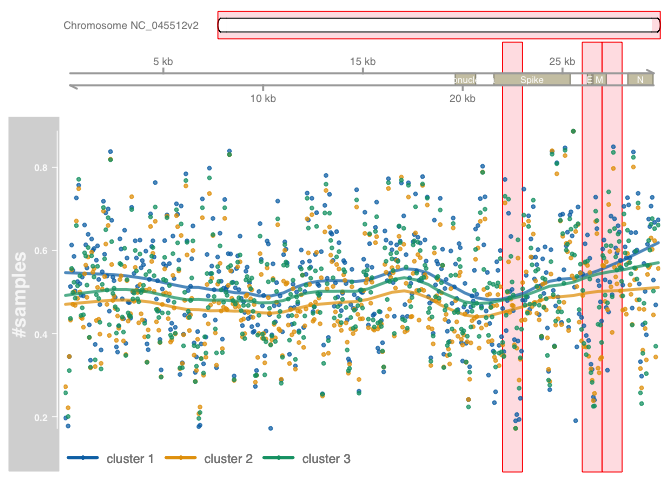
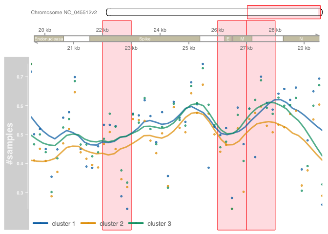

Windows analysis
================
2023-09-04

# Analysis of windows

After the statistical test comparing the clusters defined and detecting
significant windows in the genome, it calculated how many samples has
variations in determinate positions in the genome and related to
specifics genes, to do this this analysis is made in python and to
incorporate in the plots the genome of covid it uses the library gviz.

## Getting number of samples with variations in the COVID genome

This code in python process all files from freyja to detect how many
samples has variations/mutations in particular positions. Samples are
separated in clusters that were previously detected with kmeans in
02_analysis and are saved in all_results.csv.

``` python
import os 
import pandas as pd

def listdir_fullpath(d):
    return [os.path.join(d, f) for f in os.listdir(d)]
  
#reading data
all_results = pd.read_csv('all_results.csv')  

freya_files = sorted(listdir_fullpath('join_flow_cells/freyja'))

#separating clusters 
cluster1 = list(all_results[(all_results['cluster'] == 1)]['sampleId'])
cluster2 = list(all_results[(all_results['cluster'] == 2)]['sampleId'])
cluster3 = list(all_results[(all_results['cluster'] == 3)]['sampleId'])

cluster_lists = {'cluster1': cluster1,
'cluster2': cluster2,
'cluster3': cluster3}

samples_per_position = {}
for cluster_name,cluster_list in cluster_lists.items():
    cluster = {}
    for sample in cluster_list:
        for file in freya_files:
            if file.endswith('variants.tsv'):
                file_name = file.split('.')[0].split('/')[-1:][0][:-9].split('_')[-1]
                #checking files per clusters 
                sample_name = 'sample_{}'.format(file_name)[:-3]
                if sample == sample_name:

                    data = pd.read_csv(file, sep='\t')
                    pass_filter = data[data["PASS"] == True]
                    #saving positions detected per sample file
                    for pos in pass_filter['POS'].values:
                        if pos not in cluster:
                            cluster[pos] = []
                        cluster[pos].append(sample_name)

    samples_per_position[cluster_name] = cluster

#checking positions and saving samples if has variations in specific positions
count_per_pos = {}
for cluster,list_count in samples_per_position.items():
    cluster_count = {}
    for pos,samples in list_count.items():
        new_values = set(samples)
        cluster_count[pos] = len(new_values)
    
    count_per_pos[cluster] = cluster_count
    
count_per_pos_table= pd.DataFrame.from_dict(count_per_pos)

pd.DataFrame.from_dict(count_per_pos_table).to_csv('windows_cluster.csv', sep=',')
```

## Gviz

Uploading data of positions.

    ##        X cluster1 cluster2 cluster3
    ## 1      1       30       29       27
    ## 2      2       29       25       25
    ## 25758  9        0        1        0
    ## 24928 10        1        0        0
    ## 26372 13        0        0        1
    ## 24929 17        1        2        1

## Setting variable to gviz

    ## DataTrack '#samples'
    ## | genome: wuhCor1
    ## | active chromosome: NC_045512v2
    ## | positions: 27256
    ## | samples:1
    ## | strand: *

    ## Ideogram track 'NC_045512v2' for chromosome NC_045512v2 of the wuhCor1 genome

### All genome with higlight in specific window

<!-- -->

### Specific window

<!-- -->
