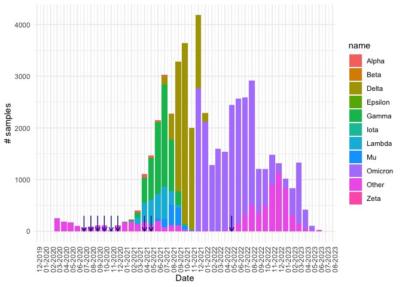
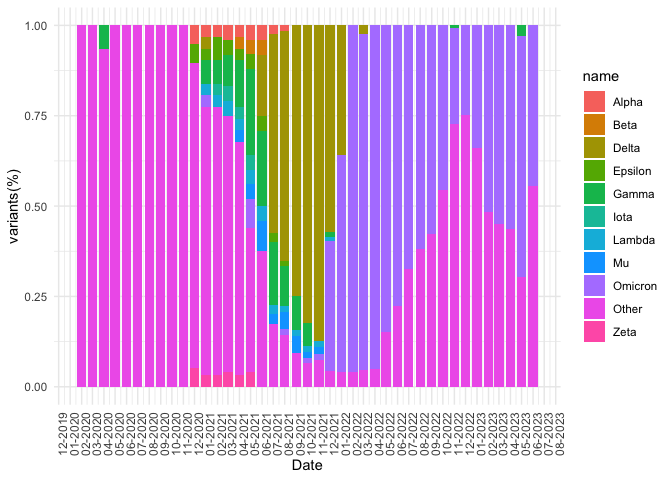

COVID context in Chile: GISAID data
================
2023-09-27

# Getting GISAID data

GISAID is a database of covid sequences from all the world. In Chile,
are reported around 45.000 samples in this platform. We downloaded
metadata of samples patients, that only included: location, institute,
date, type of samples, lineage, and mutations.

For database limits, is not possible to download all this data at a
time, so is necessary to create batches of codes to download all data.
After that, we join all tsv files with this information into one using
python.

``` python
import os
import pandas as pd

def listdir_fullpath(d):
    return [os.path.join(d, f) for f in os.listdir(d)]

files = listdir_fullpath("../GISAID/chile_data/")

all_metadata = []
for file in files:
    if file.endswith('.tsv'):
        metadata = pd.read_csv(file, sep = '\t')
        all_metadata.append(metadata)

new_df = pd.concat(all_metadata).drop_duplicates()
sorted_df = new_df.sort_values(by='Accession ID', key=lambda s: s.str[8:].astype(int))

sorted_df.to_csv('GISAID_all_chile.tsv', sep= '\t', index=False)
```

# Transforming data

Before plotting, is necessary to formatting date data from GISAID and
samples we are working on, to facilitate grouping data by month and also
to visualize.

Also is important to label samples with their corresponding name of VOI
or VOC, this to know about wich variant correspond to each lineage from
GISAID. For this we consult to:

- <https://www.cdc.gov/coronavirus/2019-ncov/variants/variant-classifications.html>
- <https://gisaid.org/hcov19-variants/>

# Plotting number of samples and percentage of variants in Chile.

## Number of samples

Here we got the number of samples in Chile from GISAID platform, we
label this with their corresponding name of VOI or VOC. With blue arrows
we point out where our samples are located on the timeline. Around years
2021 and 2022 there is huge increase in the sequencing of COVID samples
in Chile.

<!-- -->

## Percentage of variants

In the next graph, we show how the proportion of variants changes
throughout the pandemic in Chile. Just like previous graph, variants are
colored by their corresponding name of VOI or VOC.

<!-- -->
