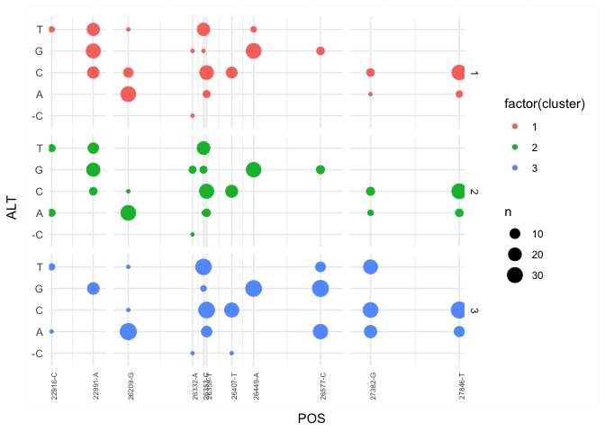

Variants and heterogeneity in samples
================
2024-01-02

## Preparing data

Using handmade curated data of important mutations in COVID genes
(Spike, ORF3a, Envelope, Membrane, ORF6, ORF7a, ORF7b, ORF8) We are
going to check if some of this mutations and variants are present in our
samples.

``` python
import pandas as pd
import os
import itertools

def listdir_fullpath(d):
    return [os.path.join(d, f) for f in os.listdir(d)]

mutations_list = pd.read_excel('Mutaciones.xlsx', sheet_name=0)

#adding information from where start the genes
genomic_pos = {
    'Spike' : 21563,
    'ORF3a' : 25393,
    'Envelope' : 26245,
    'Membrane' : 26523,
    'ORF6' : 27202,
    'ORF7a' : 27394,
    'ORF7b' : 27756,
    'ORF8' : 27894
}

#Merging protein names into dataset and transforming aminoacidic positions into nucleotidic position
new_column = []
for protein, gen_pos in genomic_pos.items():
    rows = mutations_list[mutations_list['Protein'] == protein]['Position'].values
    new_position = (rows*3)+gen_pos-3
    for new_pos in new_position:
        new_column.append(new_pos)

#adding this information into the dataset
mutations_list['Genomic_position'] = new_column

#reading information from freyja
list_freyja = sorted(listdir_fullpath('join_flow_cells/freyja'))

samples_freyja = {}
for file in list_freyja:      
    if file.endswith('variants.tsv'):
        sample = file.split('/')[-1].split('.')[0].split('_')[2][:2]
        sample = 'sample_{}'.format(sample)
        data = pd.read_csv(file, sep='\t')
        #filtering positions to get those related to the genes
        data_windows = data.query('POS > 22000 and POS < 23000 or POS > 26000 and POS < 28000')
        data_windows = data_windows.query('PASS == True')
        values = data_windows[['POS', 'REF', 'ALT']]
        values.reset_index(drop=True, inplace=True)
        samples_freyja[sample] = values.T.to_dict()
        
df_samples_freyja = pd.DataFrame.from_dict(samples_freyja, orient='index').stack().to_frame()
df_samples_freyja = pd.DataFrame(df_samples_freyja[0].values.tolist(), index=df_samples_freyja.index)


#saving datasets
df_samples_freyja.to_csv('windows_variants_freyja.tsv', sep='\t')
mutations_list.to_csv('mutations.tsv', sep='\t')
```

## Running Snpeff

### Generate vcf file

To run snpeff is neccesary to have a vcf file. In R we transform the
file windows_variants_freyja.tsv into a vcf file.

``` r
freyja <- read.table('windows_variants_freyja.tsv', sep = '\t', header = T)
mutations <- read.table('mutations.tsv', sep = '\t', header = T)
all_results <-read.table('all_results.csv', h=TRUE,sep=",")

#extracting only positoins that are reported in the mutation dataset
freyja_filter <- freyja %>% filter(POS %in% mutations$Genomic_position)
freyja_filter <- left_join(freyja_filter, all_results, by = join_by(X == sampleId))

## transofrming into vcf file 
CHROM <- c(rep('MN908947.3', dim(freyja_filter)[1]))
ID <- c(rep('.', dim(freyja_filter)[1]))
QUAL <- c(rep('.', dim(freyja_filter)[1]))
FILTER <- c(rep('.', dim(freyja_filter)[1]))
INFO <- c(rep('.', dim(freyja_filter)[1]))

freyja_filter_vcf <- freyja_filter[c('POS', 'REF', 'ALT')]

freyja_filter_vcf['CHROM'] <- CHROM
freyja_filter_vcf['ID'] <- ID
freyja_filter_vcf['QUAL'] <- QUAL
freyja_filter_vcf['FILTER'] <- FILTER
freyja_filter_vcf['INFO'] <- INFO

#reordering and selecting columns that are part of the vcf format
freyja_filter_vcf <- freyja_filter_vcf %>%
  select(CHROM, POS, ID, REF, ALT, QUAL, FILTER, INFO)

#exporting vcf data
write.table(freyja_filter_vcf, 'freyja_filter.vcf', sep = "\t",
            row.names = FALSE, quote = FALSE, col.names = TRUE)

#running vcf
```

### Processing snpeff output

The information that we need is in a column named INFO and is a single
string with multiple entries, so we need to split this information
before to work with it, this was made in python.

``` python
#reading output from snpeff
variants_info = pd.read_csv('freyja_filter.ann.vcf', sep = '\t')
#removing information from snpeff in '###'
variants_info = variants_info[5:]

#listing information that could be important
info_type = ['Allele', 'Annotation (a.k.a. effect)', 'Putative_impact', 'Gene Name', 'Gene ID', 'Feature type', 'Feature ID', 'Transcript biotype', 'Rank / total', 'HGVS.c', 'HGVS.p', 'cDNA_position / cDNA_len', 'CDS_position / CDS_len', 'Protein_position / Protein_len', 'Distance to feature']

data={}
#separating infomration from INFO column and labeling with info_type
for idx, row in variants_info.iterrows():
    values = row['INFO'].split('|')
    list_values = []
    new_values = {} 
    for x,y in zip(values, itertools.cycle(info_type)):  
        
        if y in new_values:
            list_values.append(new_values)
            new_values = {}
            new_values[y] = x
        else:
            new_values[y] = x

    data[idx] = list_values

mutations_list =  pd.DataFrame.from_dict(data, orient='index').stack().to_frame()
mutations_list = pd.DataFrame(mutations_list[0].values.tolist(), index=mutations_list.index)
mutations_list = mutations_list.join(variants_info[['POS', 'REF', 'ALT']].reindex(mutations_list.index, level=0))

#exporting data 
mutations_list.to_csv('mutations_info_freyja_filtered.tsv', sep='\t')
```

## Analysing and merging data

We come back in R to merge both datasets: snpeff output and curated
mutations data.

``` r
freyja <- read.table('windows_variants_freyja.tsv', sep = '\t', header = T)
mutations <- read.table('mutations.tsv', sep = '\t', header = T)
mutations_info <-read.table('mutations_info_freyja_filtered.tsv', h=TRUE,sep="\t")

mutations_info_filter <- mutations_info[c('POS', 'REF', 'ALT','Allele', 
                                   'Annotation..a.k.a..effect.', 'Putative_impact', 'Gene.Name',
                                   'HGVS.p', 'Protein_position...Protein_len')]  %>% filter(grepl('ANN', Allele))

#getting all information togheter in a same dataset
freyja_filter <- freyja %>% filter(POS %in% mutations$Genomic_position)
freyja_filter <- left_join(freyja_filter, all_results, by = join_by(X == sampleId))

freyja_filter_data <- freyja_filter[c('X', 'POS', 'REF', 'ALT')]

freyja_mutations_info <-  left_join(freyja_filter_data, mutations_info_filter, 
          by= c('POS' = 'POS', 'REF' = 'REF', 'ALT' = 'ALT'),
           relationship = "many-to-many", multiple='first')

freyja_mutations_info <- left_join(freyja_mutations_info, mutations, 
                                   by= c('POS' = 'Genomic_position'),
                                   relationship = "many-to-many", multiple='first')

freyja_mutations_info <- freyja_mutations_info %>%
  select(X.x, POS, REF, ALT, Original, Observation, HGVS.p, Residue, Gene.Name, 
         Protein, Protein_position...Protein_len, Position, Position_End,
         Domain, Subdomain, Annotation..a.k.a..effect., Type, Putative_impact, Effect, Reference)

write.table(freyja_mutations_info, 'freyja_mutations_info.tsv', sep = "\t", row.names = FALSE, quote = FALSE, col.names = TRUE)
```

## Figure

Now, we are going to use our table filtrated to analyse some data: how
many samples has different mutations in genes: Spike, ORF3a, Envelope,
Membrane, ORF6, ORF7a, ORF7b, ORF8.

``` r
#First we count number of variants by position and cluster
n_sampples_variant <- freyja_filter %>% group_by(POS, cluster, REF, ALT) %>% count()

#then, we filter this data to keep those positions with more than 3 counts, how we do this? with group_by(POS, REF) we are going to count all data but if a position has less than 3 variants is higly possible that is present just 1 time per cluster. 

n_sampples_variant <- n_sampples_variant %>% group_by(POS, REF) %>%  mutate(count= n()) %>% filter(count > 3) %>% ungroup()
 
#now we need to make labels for ticks in the plot 
pos_nt_nsv <- unique(n_sampples_variant[c('POS', 'REF')])
pos_nt_nsv$new_labe <- paste(pos_nt_nsv$POS, pos_nt_nsv$REF, sep = '-')

#plot
ggplot(n_sampples_variant, aes(x= POS, y = ALT, col = factor(cluster), size = n)) + 
  geom_point() + scale_x_continuous(breaks=(pos_nt_nsv$POS),
                                          labels=(pos_nt_nsv$new_labe)) +
  theme_minimal() + theme(axis.text.x = element_text(size = 6, angle = 90), 
                          axis.text.x.top = element_blank(), axis.ticks.x.top = element_blank()) +
  scale_x_break(c(23010, 26200), scales=4) + scale_x_break(c(26600, 27300), scales = 2) +
  facet_wrap(~cluster, nrow = 3, strip.position="right") 
```

<!-- -->
