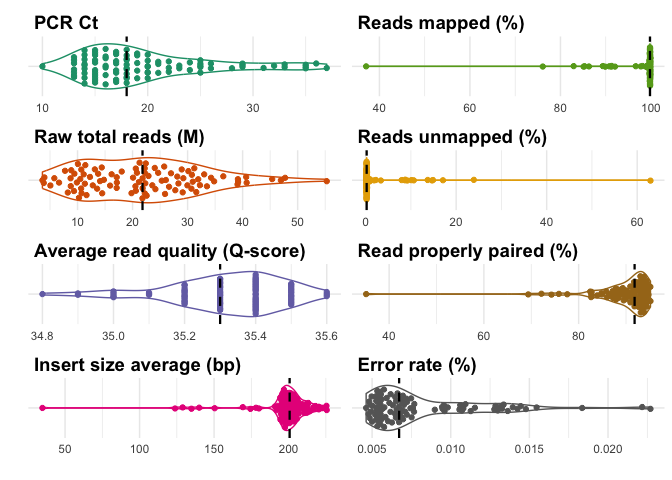
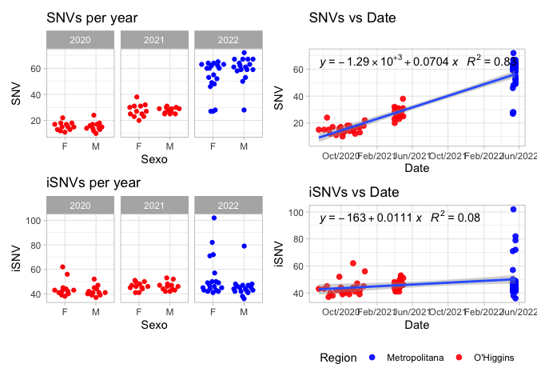
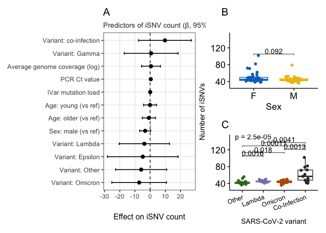
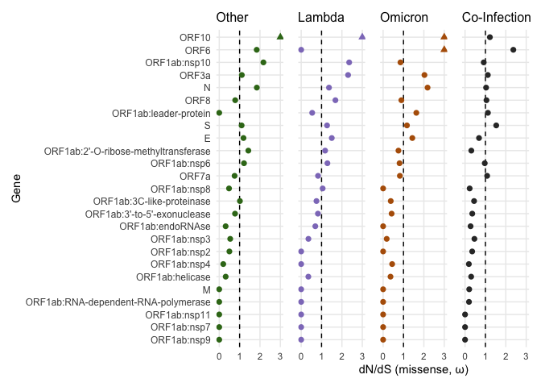
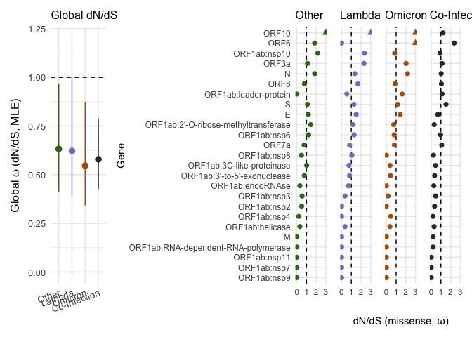

Covid Figures
================
Alex Di Genova
2025-12-09

# Figure 1

Demographic of sequenced COVID samples. \## Chilean map

Map of Chile highlithing the Rancagua y Santiago regions
<!-- -->

## Demographic of samples

``` r
library(tidyverse)
```

    ## ── Attaching core tidyverse packages ──────────────────────── tidyverse 2.0.0 ──
    ## ✔ dplyr     1.1.4     ✔ readr     2.1.5
    ## ✔ forcats   1.0.0     ✔ stringr   1.5.1
    ## ✔ lubridate 1.9.4     ✔ tibble    3.2.1
    ## ✔ purrr     1.0.4     ✔ tidyr     1.3.1
    ## ── Conflicts ────────────────────────────────────────── tidyverse_conflicts() ──
    ## ✖ dplyr::filter() masks stats::filter()
    ## ✖ dplyr::lag()    masks stats::lag()
    ## ℹ Use the conflicted package (<http://conflicted.r-lib.org/>) to force all conflicts to become errors

``` r
df=read.table("../demographics/all_samples.txt", h=T)
dates_formatted <- as.Date(df$Date, format="%m/%d/%Y")
years <- format(dates_formatted, "%Y")
df$year=years
df=df %>% mutate(Ct=as.integer(Ct))
df$all="all"
```

we make the plot

``` r
library(tidyverse)
library(ggbeeswarm)
count_data <- df %>%
  group_by(year) %>%
  summarise(count = n())

p2=ggplot(df, aes(x = year, y = Age, )) +
     #geom_boxplot(aes(group = year), color="brown", alpha = 0.5) + # Add boxplot
  geom_quasirandom(aes(color = Region, shape = Sex),width = 0.25, height = 0, size=3) +
  # geom_beeswarm(aes(color = Region, shape = Sex),width = 0.25, height = 0, size=3) +
   #geom_jitter(, width = 0.2, height = 0) +
  scale_color_manual(values = c("Metropolitana" = "blue", "O'Higgins" = "red")) +
  labs(title = "Samples",
       x = "Year",
       y = "Age") +
    theme(text = element_text(size = 12)) +
  theme_minimal()
```

    ## Warning in geom_quasirandom(aes(color = Region, shape = Sex), width = 0.25, :
    ## Ignoring unknown parameters: `height`

``` r
p2
```

<!-- -->

``` r
# Ct plots 2.1
#ggplot(df, aes(x=all,shape=Sex,y=Ct,color=Region,group=all)) + geom_quasirandom() + theme_minimal()
# Ct plots 2.2
#ggplot(df, aes(x=Age,shape=Sex,y=Ct,color=Region,group=all)) + geom_point() + theme_minimal()
```

## GISAD

## Plotting number of samples and percentage of variants in Chile.

## Number of samples

Here we got the number of samples in Chile from GISAID platform, we
label this with their corresponding name of VOI or VOC. With blue arrows
we point out where our samples are located on the timeline. Around years
2021 and 2022 there is huge increase in the sequencing of COVID samples
in Chile.

<!-- -->

We compose all plots to generate figure 1

``` r
library(patchwork)

patchwork=p1|(p2/p3)  
patchwork + plot_annotation(tag_levels = 'A')
```

<!-- -->

``` r
pdf(file="Fig1.pdf",height=7,width=9)
patchwork + plot_annotation(tag_levels = 'A')
dev.off()
```

    ## quartz_off_screen 
    ##                 2

# Supplementary Figure 1

Details about the sequenced reads, including number of reads per sample,
read length and read quality, adaptor sequence content ect.

``` r
library(ggbeeswarm)
library(tidyverse)
mq_jfc = read.table('../figure_qc/join_flow_cells/multiqc_samtools_stats.txt', header = TRUE)
mq_jfc$barcode=as.integer(str_extract(mq_jfc$Sample,"(?<=-)\\d+"))
mq_jfc=left_join(mq_jfc,df,by=c("barcode"="barcode"))
mq_jfc = mq_jfc %>% dplyr::select(Sample,
                           raw_total_sequences,
                           error_rate,average_quality,
                           insert_size_average,
                           reads_mapped_percent,
                           reads_properly_paired_percent,
                           reads_unmapped_percent,
                           Ct)
mq_jfc = mq_jfc %>% mutate(raw_total_sequences=raw_total_sequences/1000000)
order_fct=c("Ct",
            "raw_total_sequences",
            "average_quality",
            "insert_size_average",
            "reads_mapped_percent",
            "reads_unmapped_percent",
            "reads_properly_paired_percent",
            "error_rate")
order_fct_r=c("PCR Ct",
              "Raw total reads (M)", 
              "Average read quality (Q-score)",
              "Insert size average (bp)" ,
              "Reads mapped (%)",
              "Reads unmapped (%)",
              "Read properly paired (%)",
              "Error rate (%)")
colors <- setNames(RColorBrewer::brewer.pal(name = "Dark2", n =8),order_fct_r)
#pivot longer
mq_jfc=mq_jfc %>% pivot_longer(-Sample)

mq_jfc$rename=setNames(order_fct_r, order_fct)[mq_jfc$name]

sf1=mq_jfc %>% 
  mutate(name = fct_relevel(rename, order_fct_r)) %>%
  ggplot(aes(y=rename,x=value,color=rename,group=name)) + 
  geom_violin()+
  geom_quasirandom(orientation="y") + 
  scale_color_manual(values=colors)+
  stat_summary(fun = median, geom = "vline", aes(xintercept = ..x..), linetype = 2, linewidth= 0.8, color = "black") +
  ylab("")  +
  xlab("")+
   theme_minimal()+ facet_wrap(.~name,scales="free",ncol=2,dir="v") +  
  theme(legend.position = "none",
        axis.text.y = element_blank(), 
        strip.text.x = element_text(
        size = 14,
        color = "black", 
        face = "bold", 
        hjust = 0)
        )

sf1
```

    ## Warning: The dot-dot notation (`..x..`) was deprecated in ggplot2 3.4.0.
    ## ℹ Please use `after_stat(x)` instead.
    ## This warning is displayed once every 8 hours.
    ## Call `lifecycle::last_lifecycle_warnings()` to see where this warning was
    ## generated.

<!-- -->

``` r
pdf("SF1.pdf")
sf1
dev.off()
```

    ## quartz_off_screen 
    ##                 2

We create a table to give the information in main text

``` r
mq_jfc %>% group_by(rename) %>% summarise(total=sum(value),median=median(value),mean=mean(value),min=min(value),max=max(value),sd=sd(value))
```

    ## # A tibble: 8 × 7
    ##   rename                           total  median    mean     min     max      sd
    ##   <chr>                            <dbl>   <dbl>   <dbl>   <dbl>   <dbl>   <dbl>
    ## 1 Average read quality (Q-score) 3.39e+3 3.53e+1 3.53e+1 3.48e+1 3.56e+1 1.60e-1
    ## 2 Error rate (%)                 7.78e-1 6.72e-3 8.10e-3 4.62e-3 2.27e-2 3.71e-3
    ## 3 Insert size average (bp)       1.89e+4 2.01e+2 1.97e+2 3.48e+1 2.26e+2 2.43e+1
    ## 4 PCR Ct                         1.90e+3 1.8 e+1 1.97e+1 1   e+1 3.7 e+1 6.21e+0
    ## 5 Raw total reads (M)            2.09e+3 2.18e+1 2.18e+1 3.62e+0 5.53e+1 1.11e+1
    ## 6 Read properly paired (%)       8.59e+3 9.18e+1 8.95e+1 3.51e+1 9.52e+1 7.56e+0
    ## 7 Reads mapped (%)               9.37e+3 9.98e+1 9.76e+1 3.71e+1 9.99e+1 7.56e+0
    ## 8 Reads unmapped (%)             2.34e+2 2.29e-1 2.43e+0 1.12e-1 6.29e+1 7.56e+0

# Figure 2

Philogenetics, variants detected and coverage.

## Phylogenetic tree

We plot the tree including variants type, iVAR snp distribution and
number of SNPs

``` r
library(ggtree)

# Customize further as needed
p4 <- ggtree(x_new, color="grey40", ladderize = TRUE) +
  #xlim_tree(0.00325) +
  geom_tiplab(aes(color=variant, label = sampleId), size=2.) +
  scale_color_manual('', values = variant) +
  scale_fill_manual('', values = variant) +
  guides(color = guide_legend(override.aes = list(size = 5, label = "\u25AA")))+
  theme_tree2(legend.position = "bottom")

# add SNP data by position in the tree
p5= p4 + geom_facet(panel = "SNPs coordinates", data = ivdt_longer, geom = geom_point, 
               mapping=aes(x = pos,group=sampleId, color=variant,fill=variant), shape = '|') +
             geom_facet(panel = "# SNPs", data = ivar_c, geom = geom_col, 
                aes(x = value, color = variant, fill=variant), orientation = 'y', width = .6)
p5
```

<!-- -->

``` r
#facet_widths(p8, widths = c(2, 2, 1))
pdf(file="Fig2.pdf",height=7,width=9)
facet_widths(p5, widths = c(2, 2, 1))
```

    ## Warning in grid.Call.graphics(C_text, as.graphicsAnnot(x$label), x$x, x$y, :
    ## conversion failure on '▪' in 'mbcsToSbcs': for ▪ (U+25AA)
    ## Warning in grid.Call.graphics(C_text, as.graphicsAnnot(x$label), x$x, x$y, :
    ## conversion failure on '▪' in 'mbcsToSbcs': for ▪ (U+25AA)
    ## Warning in grid.Call.graphics(C_text, as.graphicsAnnot(x$label), x$x, x$y, :
    ## conversion failure on '▪' in 'mbcsToSbcs': for ▪ (U+25AA)
    ## Warning in grid.Call.graphics(C_text, as.graphicsAnnot(x$label), x$x, x$y, :
    ## conversion failure on '▪' in 'mbcsToSbcs': for ▪ (U+25AA)
    ## Warning in grid.Call.graphics(C_text, as.graphicsAnnot(x$label), x$x, x$y, :
    ## conversion failure on '▪' in 'mbcsToSbcs': for ▪ (U+25AA)
    ## Warning in grid.Call.graphics(C_text, as.graphicsAnnot(x$label), x$x, x$y, :
    ## conversion failure on '▪' in 'mbcsToSbcs': for ▪ (U+25AA)
    ## Warning in grid.Call.graphics(C_text, as.graphicsAnnot(x$label), x$x, x$y, :
    ## conversion failure on '▪' in 'mbcsToSbcs': for ▪ (U+25AA)
    ## Warning in grid.Call.graphics(C_text, as.graphicsAnnot(x$label), x$x, x$y, :
    ## conversion failure on '▪' in 'mbcsToSbcs': for ▪ (U+25AA)

``` r
dev.off()
```

    ## quartz_off_screen 
    ##                 2

# Figure 3

Genome coverage

## Samtools depth

Checking depth of the samples and separate them by variant and location.

``` r
suppressMessages(library('reshape2'))
samtools_results <-read.table('samtools_depth.csv', h=TRUE,sep=",")
samtools_results <- melt(samtools_results, id="X")
colnames(samtools_results) <- c('pos', 'sampleId', 'depth')

samtools_results <- left_join(samtools_results,all_results[c('sampleId', 'location', 'variant')], by="sampleId")
samtools_results<-samtools_results[!grepl("71", samtools_results$sample),]

samtools_results <- samtools_results %>% group_by(variant)

samtools_results <- samtools_results %>% group_by(variant) %>%
  mutate(med = mean(depth, na.rm = TRUE))

samtools_depth_range <- samtools_results %>%
  group_by(sampleId, grp = cut(pos, breaks=pretty(pos, n = 60), dig.lab = 5),  variant, med) %>% 
  summarise(count = mean(depth, na.rm = TRUE))
```

    ## `summarise()` has grouped output by 'sampleId', 'grp', 'variant'. You can
    ## override using the `.groups` argument.

### Samtools depth plot

    ## Warning: Using `size` aesthetic for lines was deprecated in ggplot2 3.4.0.
    ## ℹ Please use `linewidth` instead.
    ## This warning is displayed once every 8 hours.
    ## Call `lifecycle::last_lifecycle_warnings()` to see where this warning was
    ## generated.

    ## Warning: Removed 7 rows containing missing values or values outside the scale range
    ## (`geom_line()`).

<!-- -->

    ## Warning: Removed 7 rows containing missing values or values outside the scale range
    ## (`geom_line()`).

    ## quartz_off_screen 
    ##                 2

# Figure 4

Heterogeneity analysis

## SNVs

``` r
library(tidyverse)
csv_files <- list.files(pattern="*.variants.tsv",path = "../SNVs/")
l_data <- list()
for (file in csv_files) {
  data <- read.table(paste0("../SNVs/",file),h=T)
  #data <- data %>% filter(ALT_FREQ >=0.95)
  data$Filename <- file
  l_data[[file]] <- data
}
SNV_ivar <- bind_rows(l_data)
SNV_ivar$barcode=as.integer(str_extract(SNV_ivar$Filename,"(?<=-)\\d+"))
```

## iSNVs

loading a cleaning iSNV data, our filters include ALT_FREQ in \[0.05 to
0.95\], ALT_quality \> 30, ALT_DP \>100 as well as virus load \<= 28,
and no co-infection.

``` r
csv_files <- list.files(pattern="*_variants.tsv",path = "../iSNVs/")
filtered_data <- list()
for (file in csv_files) {
  data <- read.table(paste0("../iSNVs/",file),h=T)
  dataf=data %>% filter(ALT_DP >=100) %>% filter(PASS=="TRUE")%>% filter(ALT_FREQ >= 0.05 & ALT_FREQ<0.95 & ALT_QUAL > 30)
  dataf$Filename <- file
  filtered_data[[file]] <- dataf
}
#dim(iSNVs)
iSNVs <- bind_rows(filtered_data)
iSNVs$barcode=as.integer(str_extract(iSNVs$Filename,"(?<=-)\\d+"))
#we remove all variants calls by ivar in the same sample/position
iSNVs=iSNVs %>% filter(!paste0(barcode,POS,ALT) %in% paste0(SNV_ivar$barcode,SNV_ivar$POS,SNV_ivar$ALT))

iSNVs_count = iSNVs %>%group_by(Filename) %>% count()
iSNVs_count$barcode=as.integer(str_extract(iSNVs_count$Filename,"(?<=-)\\d+"))
iSNV_data=left_join(iSNVs_count,df) %>% mutate(age2=if_else(Age < 30,"young",if_else(Age >=30 & Age<50,"adult","older")))
```

    ## Joining with `by = join_by(barcode)`

``` r
b=all_results %>% mutate(barcode=as.integer(str_extract(sampleId,"(?<=_)\\d+")))  %>% dplyr::select(barcode,mut_ivar,variant)
iSNV_data=left_join(iSNV_data,b)
```

    ## Joining with `by = join_by(barcode)`

``` r
iSNV_data=iSNV_data %>% mutate(variant=if_else(variant=="BA.2* [Omicron (BA.2.X)]","Omicron",variant))

# Ct <= 28
iSNV_data=iSNV_data%>% filter(Ct<=28)
# filtro de Co-infection muestras con mayor de 3% de por mas de otra variante
ff=read.table("aggregated-freyja-parse.tsv",h=T,sep="\t")
fff=ff%>%filter(percentage*100 > 3) %>%dplyr::select(file) %>% group_by(file) %>% count() %>% filter(n>1)

library(dplyr)

# Example input (your data frame)
# ff <- read.table("your_table.tsv", header = TRUE, sep = "\t")

# Filter and summarize
co_infect_table <- ff %>%
  filter(percentage > 0.03) %>%                  # Keep relevant variants
  group_by(file) %>%
  summarise(
    n_variants = n_distinct(variant),            # Number of variants detected
    variants = paste(unique(variant), collapse = ", ")  # Variant names
  ) %>%
  mutate(
    co_infection = ifelse(n_variants > 1, "Yes", "No")
  ) %>%
  arrange(desc(n_variants)) %>% filter(n_variants > 1)

# View result
print(co_infect_table)
```

    ## # A tibble: 19 × 4
    ##    file                              n_variants variants            co_infection
    ##    <chr>                                  <int> <chr>               <chr>       
    ##  1 V350082740_L14_68-68_variants.tsv          5 Other, Gamma, BA.2… Yes         
    ##  2 V350082740_L14_88-88_variants.tsv          5 Omicron, BA.2* [Om… Yes         
    ##  3 V350082740_L14_56-56_variants.tsv          4 BA.2* [Omicron (BA… Yes         
    ##  4 V350082740_L14_59-59_variants.tsv          4 BA.2* [Omicron (BA… Yes         
    ##  5 V350082740_L14_03-03_variants.tsv          3 Other, Omicron, BA… Yes         
    ##  6 V350082740_L14_50-50_variants.tsv          3 BA.2* [Omicron (BA… Yes         
    ##  7 V350082740_L14_53-53_variants.tsv          3 Other, Gamma, Lamb… Yes         
    ##  8 V350082740_L14_61-61_variants.tsv          3 Other, Omicron, Ga… Yes         
    ##  9 V350082740_L14_73-73_variants.tsv          3 Other, Omicron, La… Yes         
    ## 10 V350082740_L14_76-76_variants.tsv          3 Omicron, Other, Ga… Yes         
    ## 11 V350082740_L14_77-77_variants.tsv          3 Other, Gamma, BA.2… Yes         
    ## 12 V350082740_L14_79-79_variants.tsv          3 BA.2* [Omicron (BA… Yes         
    ## 13 V350082740_L14_17-17_variants.tsv          2 Other, Gamma        Yes         
    ## 14 V350082740_L14_44-44_variants.tsv          2 Gamma, Other        Yes         
    ## 15 V350082740_L14_48-48_variants.tsv          2 Gamma, Other        Yes         
    ## 16 V350082740_L14_49-49_variants.tsv          2 BA.2* [Omicron (BA… Yes         
    ## 17 V350082740_L14_58-58_variants.tsv          2 BA.2* [Omicron (BA… Yes         
    ## 18 V350082740_L14_70-70_variants.tsv          2 Omicron, Lambda     Yes         
    ## 19 V350082740_L14_87-87_variants.tsv          2 BA.2* [Omicron (BA… Yes

``` r
fff$barcode=as.integer(str_extract(fff$file,"(?<=-)\\d+"))
iSNV_coi=iSNV_data %>% filter(barcode %in% fff$barcode)
iSNV_data=iSNV_data %>% filter(!barcode %in% fff$barcode)
iSNV_coi$variant="Co-Infection"
iSNV_data=rbind(iSNV_data,iSNV_coi)
# load coverage data
gcov=read.table("resume_samtools_coverage.txt",h=T)
gcov=gcov %>% mutate(barcode=as.integer(str_extract(sname,"(?<=-)\\d+"))) %>% dplyr::select(barcode,meandepth,coverage) %>%mutate(logc=log10(meandepth))
iSNV_data=left_join(iSNV_data,gcov)
```

    ## Joining with `by = join_by(barcode)`

``` r
iSNV_coi=left_join(iSNV_coi,gcov)
```

    ## Joining with `by = join_by(barcode)`

``` r
# we filter the iSNVs position relative to the samples filtered in the previos steps
iSNVs=iSNVs %>% filter(barcode %in% iSNV_data$barcode)
iSNVs=left_join(iSNVs,iSNV_data %>% dplyr::select(barcode,variant,Sex,meandepth), by=c("barcode"="barcode"))
```

    ## Adding missing grouping variables: `Filename`

``` r
# improve co-infection panel plot
#pfrya=ff %>% mutate(variant=if_else(str_detect(variant,"Omicron"),"Omicron",variant)) %>% filter(percentage*100 > 3)%>% ggplot(aes(x=fct_reorder2(file,desc(percentage),variant),y=percentage,fill=variant)) + geom_col() + theme_minimal() + labs(x="Samples", y="% variant") + theme( axis.text.x=element_blank())
```

### Comparison iSNV vs SNV

SNVs increase as function of time but iSNVs do not increase with time.
Indicating other forces

``` r
library(ggpmisc)
```

    ## Loading required package: ggpp

    ## Registered S3 methods overwritten by 'ggpp':
    ##   method                  from   
    ##   heightDetails.titleGrob ggplot2
    ##   widthDetails.titleGrob  ggplot2

    ## 
    ## Attaching package: 'ggpp'

    ## The following object is masked from 'package:ggplot2':
    ## 
    ##     annotate

``` r
MutSNV=SNV_ivar %>% count(barcode) %>% inner_join(.,df)
```

    ## Joining with `by = join_by(barcode)`

``` r
p1=MutSNV %>% filter(Ct<=28) %>% ggplot(aes(x=Sex,y=n,color = Region)) + geom_quasirandom() + 
  facet_wrap(~year)+
   scale_color_manual(values = c("Metropolitana" = "blue", "O'Higgins" = "red")) + 
  labs(x="Sexo",y="SNV",color = "Region",title="SNVs per year")+
  theme_light() +theme(legend.position = "none") 

p2=iSNV_data %>% filter(Ct<=28) %>% ggplot(aes(x=Sex,y=n,color = Region)) + geom_quasirandom() + 
  facet_wrap(~year)+
   scale_color_manual(values = c("Metropolitana" = "blue", "O'Higgins" = "red")) + 
  labs(x="Sexo",y="iSNV",color = "Region",title="iSNVs per year")+
  theme_light() +theme(legend.position = "none") 
#p1/p2


### 

p3=MutSNV %>% filter(Ct<=28) %>%mutate(Date = as.Date(Date,format = "%m/%d/%Y"))%>% ggplot(aes(x=Date,y=n)) + geom_point(aes(color=Region),size=2,alpha = 0.9) + geom_smooth(method = "lm", se = TRUE) + 
   stat_poly_eq(
    aes(label = paste( after_stat(eq.label),after_stat(rr.label), sep = "~~~")),
    formula = y ~ x,
    parse = TRUE
  ) +
  labs(title = "SNVs vs Date") + 
  scale_x_date(date_breaks = "4 months", date_labels = "%b/%Y") +
  labs(x="Date",y="SNV")+
  scale_color_manual(values = c("Metropolitana" = "blue", "O'Higgins" = "red")) + 
  theme_light() +theme(legend.position = "none") 

p4=iSNV_data %>% filter(Ct<=28) %>%mutate(Date = as.Date(Date,format = "%m/%d/%Y"))%>% ggplot(aes(x=Date,y=n)) + geom_point(aes(color=Region),size=2,alpha = 0.9) + geom_smooth(method = "lm", se = TRUE) + 
   stat_poly_eq(
    aes(label = paste( after_stat(eq.label),after_stat(rr.label), sep = "~~~")),
    formula = y ~ x,
    parse = TRUE
  ) +
  labs(title = "iSNVs vs Date") + 
  scale_x_date(date_breaks = "4 months", date_labels = "%b/%Y") +
  labs(x="Date",y="iSNV")+
  scale_color_manual(values = c("Metropolitana" = "blue", "O'Higgins" = "red")) + 
  theme_light() +theme(legend.position = "bottom") 

(p1/p2)|(p3/p4) 
```

    ## `geom_smooth()` using formula = 'y ~ x'

    ## `geom_smooth()` using formula = 'y ~ x'

<!-- -->

``` r
pdf(file="SNV_iSNV_date.pdf",width = 8, height =6)
(p1/p2)|(p3/p4) 
```

    ## `geom_smooth()` using formula = 'y ~ x'
    ## `geom_smooth()` using formula = 'y ~ x'

``` r
dev.off()
```

    ## quartz_off_screen 
    ##                 2

``` r
MutSNV=MutSNV %>% filter(Ct<=28) %>%mutate(Date = as.Date(Date,format = "%m/%d/%Y"))
summary(lm(n~Date,data=MutSNV))
```

    ## 
    ## Call:
    ## lm(formula = n ~ Date, data = MutSNV)
    ## 
    ## Residuals:
    ##     Min      1Q  Median      3Q     Max 
    ## -28.698  -3.331   1.288   4.640  16.162 
    ## 
    ## Coefficients:
    ##               Estimate Std. Error t value Pr(>|t|)    
    ## (Intercept) -1.290e+03  6.746e+01  -19.13   <2e-16 ***
    ## Date         7.039e-02  3.579e-03   19.67   <2e-16 ***
    ## ---
    ## Signif. codes:  0 '***' 0.001 '**' 0.01 '*' 0.05 '.' 0.1 ' ' 1
    ## 
    ## Residual standard error: 8.267 on 82 degrees of freedom
    ## Multiple R-squared:  0.8251, Adjusted R-squared:  0.823 
    ## F-statistic: 386.9 on 1 and 82 DF,  p-value: < 2.2e-16

``` r
iSNV_data=iSNV_data %>% filter(Ct<=28) %>%mutate(Date = as.Date(Date,format = "%m/%d/%Y"))
summary(lm(n~Date,data=iSNV_data))
```

    ## 
    ## Call:
    ## lm(formula = n ~ Date, data = iSNV_data)
    ## 
    ## Residuals:
    ##     Min      1Q  Median      3Q     Max 
    ## -14.146  -5.051  -2.107   0.753  51.932 
    ## 
    ## Coefficients:
    ##               Estimate Std. Error t value Pr(>|t|)   
    ## (Intercept) -1.628e+02  7.952e+01  -2.047  0.04381 * 
    ## Date         1.113e-02  4.218e-03   2.639  0.00996 **
    ## ---
    ## Signif. codes:  0 '***' 0.001 '**' 0.01 '*' 0.05 '.' 0.1 ' ' 1
    ## 
    ## Residual standard error: 9.745 on 82 degrees of freedom
    ## Multiple R-squared:  0.07827,    Adjusted R-squared:  0.06703 
    ## F-statistic: 6.963 on 1 and 82 DF,  p-value: 0.009955

### Regression model

``` r
iSNVlm=lm(iSNV_data$n~iSNV_data$age2+iSNV_data$Sex
          +iSNV_data$mut_ivar+iSNV_data$variant+iSNV_data$Ct+iSNV_data$logc)
summary(iSNVlm)
```

    ## 
    ## Call:
    ## lm(formula = iSNV_data$n ~ iSNV_data$age2 + iSNV_data$Sex + iSNV_data$mut_ivar + 
    ##     iSNV_data$variant + iSNV_data$Ct + iSNV_data$logc)
    ## 
    ## Residuals:
    ##     Min      1Q  Median      3Q     Max 
    ## -21.737  -3.336  -0.253   2.319  38.748 
    ## 
    ## Coefficients:
    ##                               Estimate Std. Error t value Pr(>|t|)  
    ## (Intercept)                   39.58857   17.27703   2.291   0.0249 *
    ## iSNV_data$age2older           -0.79261    2.17133  -0.365   0.7162  
    ## iSNV_data$age2young           -0.06784    2.13228  -0.032   0.9747  
    ## iSNV_data$SexM                -3.25486    1.82192  -1.786   0.0783 .
    ## iSNV_data$mut_ivar             0.04133    0.11833   0.349   0.7279  
    ## iSNV_data$variantCo-Infection  9.75494    8.71480   1.119   0.2668  
    ## iSNV_data$variantEpsilon      -4.82921   11.66299  -0.414   0.6801  
    ## iSNV_data$variantGamma         0.66904    8.88499   0.075   0.9402  
    ## iSNV_data$variantLambda       -3.78506    8.31454  -0.455   0.6503  
    ## iSNV_data$variantOmicron      -7.22536    9.03985  -0.799   0.4268  
    ## iSNV_data$variantOther        -5.90248    8.42663  -0.700   0.4859  
    ## iSNV_data$Ct                   0.44102    0.28120   1.568   0.1212  
    ## iSNV_data$logc                 0.58116    3.11725   0.186   0.8526  
    ## ---
    ## Signif. codes:  0 '***' 0.001 '**' 0.01 '*' 0.05 '.' 0.1 ' ' 1
    ## 
    ## Residual standard error: 7.924 on 71 degrees of freedom
    ## Multiple R-squared:  0.4723, Adjusted R-squared:  0.3831 
    ## F-statistic: 5.296 on 12 and 71 DF,  p-value: 2.702e-06

``` r
# Packages
library(ggpubr)
```

    ## 
    ## Attaching package: 'ggpubr'

    ## The following objects are masked from 'package:ggpp':
    ## 
    ##     as_npc, as_npcx, as_npcy

    ## The following object is masked from 'package:ape':
    ## 
    ##     rotate

    ## The following object is masked from 'package:ggtree':
    ## 
    ##     rotate

``` r
library(broom)
library(dplyr)
library(ggplot2)
library(glue)
library(patchwork)

#=============================
# A) Linear model forest plot
#=============================
fit <- iSNVlm

coef_df <- tidy(fit, conf.int = TRUE) %>%
  dplyr::filter(term != "(Intercept)") %>%
  dplyr::mutate(
    term_label = dplyr::case_when(
      term == "iSNV_data$age2older"            ~ "Age: older (vs ref)",
      term == "iSNV_data$age2young"            ~ "Age: young (vs ref)",
      term == "iSNV_data$SexM"                 ~ "Sex: male (vs ref)",
      term == "iSNV_data$Ct"                   ~ "PCR Ct value",
      term == "iSNV_data$logc"                 ~ "Average genome coverage (log)",
      term == "iSNV_data$mut_ivar"             ~ "iVar mutation load",
      term == "iSNV_data$variantCo-Infection"  ~ "Variant: co-infection",
      term == "iSNV_data$variantEpsilon"       ~ "Variant: Epsilon",
      term == "iSNV_data$variantGamma"         ~ "Variant: Gamma",
      term == "iSNV_data$variantLambda"        ~ "Variant: Lambda",
      term == "iSNV_data$variantOmicron"       ~ "Variant: Omicron",
      term == "iSNV_data$variantOther"         ~ "Variant: Other",
      TRUE ~ term
    ),
    sig = dplyr::case_when(
      p.value < 0.001 ~ "***",
      p.value < 0.01  ~ "**",
      p.value < 0.05  ~ "*",
      p.value < 0.1   ~ "·",
      TRUE            ~ ""
    ),
    term_label = reorder(term_label, estimate)
  )

gl <- glance(fit)
subtitle_txt <- glue(
  "Adj. R² = {round(gl$adj.r.squared, 3)};  F({gl$df.null - gl$df.residual}, {gl$df.residual}) = ",
  "{round(gl$statistic, 2)}, p = {signif(gl$p.value, 3)}"
)
```

    ## Warning: Unknown or uninitialised column: `df.null`.

``` r
p_model <- ggplot(coef_df, aes(x = term_label, y = estimate)) +
  geom_hline(yintercept = 0, linetype = "dashed") +
  geom_errorbar(aes(ymin = conf.low, ymax = conf.high), width = 0.2, linewidth = 0.6) +
  geom_point(size = 2.3) +
  geom_text(aes(label = sig, y = conf.high), vjust = -0.6, size = 4) +
  coord_flip() +
  labs(
    title = "A",
    subtitle = "Predictors of iSNV count (β, 95% CI)",
    x = NULL, y = "Effect on iSNV count",
    #caption = "Stars: *** p<0.001, ** p<0.01, * p<0.05, · p<0.10"
  ) +
  theme_bw(base_size = 12) +
  theme(
    plot.title = element_text(size = 16, hjust = 0, face = "plain"),
    plot.subtitle = element_text(color = "grey20", size = 11),
    panel.grid.minor = element_blank(),
    axis.text.y = element_text(size = 10),
    axis.title.y = element_text(size = 11)
  )

#=============================
# B) Sex comparison (Wilcoxon)
#=============================
sex_comparisons <- list(c("F","M"))

p_sex <- ggboxplot(
  iSNV_data, x = "Sex", y = "n",
  color = "Sex", palette = "jco",
  add = "jitter", #size = 1.8
) +
  stat_compare_means(
    comparisons = sex_comparisons,
    method = "wilcox.test", exact = FALSE,
    label = "p.format"
  ) +
  labs(title = "B", x = "Sex", y = NULL) +
  ylim(30, 150) +
  theme_pubr(base_size = 14) +
  theme(
    legend.position = "none",
    plot.title = element_text(size = 16, hjust = -0.1, face = "plain")
  )

#=============================
# C) Variant comparison (K–W + pairs)
#=============================
mvars <- c("Lambda", "Omicron", "Other", "Co-Infection")
iSNV_data_tmp <- iSNV_data %>% dplyr::filter(variant %in% mvars)

pairwise_comparisons <- list(
 # c("Lambda", "Omicron"),
  c("Other", "Lambda"),
  c("Omicron", "Other"),
  c("Co-Infection", "Omicron"),
  c("Co-Infection", "Other"),
  c("Co-Infection", "Lambda")
)

variant_colors <- c(
  "Lambda" = "#8E7CC3",
  "Omicron" = "#B45F06",
  "Other" = "#38761D",
  "Co-Infection" = "#333333"
)

p_variant <- ggboxplot(
  iSNV_data_tmp, x = "variant", y = "n",
  color = "variant", palette = variant_colors,
  add = "jitter", #size = 1.8, width = 0.6
) +
  stat_compare_means(comparisons = pairwise_comparisons, exact = FALSE, label = "p.format") +
  stat_compare_means(label.y = 145, method = "kruskal.test", label = "p.format") +
  labs(title = "C", x = "SARS-CoV-2 variant", y = NULL) +
  ylim(30, 150) +
  theme_pubr(base_size = 14) +
  theme(
    legend.position = "none",
    axis.text.x = element_text(size = 10, angle = 20, hjust = 1),
    axis.title.x = element_text(size = 11, margin = margin(t = 10)),
    plot.title = element_text(size = 16, hjust = -0.1, face = "plain")
  )

#=============================
# Shared y-axis label for B+C
#=============================
y_shared <- ggplot() +
  annotate("text", x = 0, y = 0,
           label = "Number of iSNVs",
           angle = 90, size = 4) +
  theme_void() +
  theme(plot.margin = margin(r = 2))

# Stack B over C (remove their y labels); prepend the shared y-label column
right_block <- (p_sex / p_variant) + plot_layout(heights = c(1, 1))
right_block_with_ylabel <- y_shared | right_block
right_block_with_ylabel <- right_block_with_ylabel + plot_layout(widths = c(0.06, 1))

#=============================
# Final 2-column figure: A | (B/C with shared y)
#=============================
final_fig <- p_model | right_block_with_ylabel
final_fig <- final_fig + plot_layout(widths = c(1.05, 1.35))

pdf("Fig4_new.pdf",width = 8, height = 6)
final_fig
```

    ## Warning in wilcox.test.default(c(43, 43, 40, 38, 42, 44, 41, 39, 42, 45, :
    ## cannot compute exact p-value with ties

    ## Warning in wilcox.test.default(c(43, 43, 37, 40, 38, 42, 52, 44, 41, 39, :
    ## cannot compute exact p-value with ties

    ## Warning in wilcox.test.default(c(46, 43, 43, 46, 49, 42, 44, 45, 36, 45, :
    ## cannot compute exact p-value with ties

    ## Warning in wilcox.test.default(c(45, 62, 52, 51, 41, 79, 82, 42, 72, 71, :
    ## cannot compute exact p-value with ties

    ## Warning in wilcox.test.default(c(45, 62, 52, 51, 41, 79, 82, 42, 72, 71, :
    ## cannot compute exact p-value with ties

    ## Warning in wilcox.test.default(c(45, 62, 52, 51, 41, 79, 82, 42, 72, 71, :
    ## cannot compute exact p-value with ties

    ## Warning: No shared levels found between `names(values)` of the manual scale and the
    ## data's fill values.

    ## Warning in grid.Call.graphics(C_text, as.graphicsAnnot(x$label), x$x, x$y, :
    ## conversion failure on 'Predictors of iSNV count (β, 95% CI)' in 'mbcsToSbcs':
    ## for β (U+03B2)

``` r
dev.off()
```

    ## quartz_off_screen 
    ##                 2

``` r
final_fig
```

    ## Warning in wilcox.test.default(c(43, 43, 40, 38, 42, 44, 41, 39, 42, 45, :
    ## cannot compute exact p-value with ties

    ## Warning in wilcox.test.default(c(43, 43, 37, 40, 38, 42, 52, 44, 41, 39, :
    ## cannot compute exact p-value with ties

    ## Warning in wilcox.test.default(c(46, 43, 43, 46, 49, 42, 44, 45, 36, 45, :
    ## cannot compute exact p-value with ties

    ## Warning in wilcox.test.default(c(45, 62, 52, 51, 41, 79, 82, 42, 72, 71, :
    ## cannot compute exact p-value with ties

    ## Warning in wilcox.test.default(c(45, 62, 52, 51, 41, 79, 82, 42, 72, 71, :
    ## cannot compute exact p-value with ties

    ## Warning in wilcox.test.default(c(45, 62, 52, 51, 41, 79, 82, 42, 72, 71, :
    ## cannot compute exact p-value with ties

    ## Warning: No shared levels found between `names(values)` of the manual scale and the
    ## data's fill values.

<!-- -->

Mutation types distribution and count

``` r
library(ggridges)
tmp=iSNVs %>% dplyr::select("REGION","POS","REF", "ALT","ALT_FREQ","variant") %>% filter(variant %in% c("Co-Infection","Omicron","Lambda","Other")) %>% mutate(allele=paste0(REF,"->",ALT))
tmp2=tmp
tmp2$variant="all"
tmp=rbind(tmp,tmp2)

tmp$allele=factor(tmp$allele,levels=names(sort(table(tmp$allele))))


  

p1=tmp  %>% ggplot(aes(y=allele,x=ALT_FREQ,fill=allele,color=allele))  +  geom_density_ridges() + theme_ridges(center_axis_labels=TRUE) + facet_wrap(.~variant,ncol=1) + theme(legend.position = "none") + labs(x="Frequency", y="Mutation types")

p2=tmp %>% ggplot(aes(y=allele,x=ALT_FREQ,fill=allele,color=allele))  +  geom_col() +  facet_wrap(.~variant,ncol=1) + theme_ridges(center_axis_labels=TRUE) + theme(legend.position = "none",axis.text.y = element_blank(),axis.title.y = element_blank()) + labs(x="Count") 

pdf("Fig5_new.pdf",width = 7, height = 11)
p1+p2 + plot_layout(widths = c(3,1))
```

    ## Picking joint bandwidth of 0.0524

    ## Picking joint bandwidth of 0.0746

    ## Picking joint bandwidth of 0.037

    ## Picking joint bandwidth of 0.0503

    ## Picking joint bandwidth of 0.0356

``` r
dev.off()
```

    ## quartz_off_screen 
    ##                 2

``` r
p1+p2 + plot_layout(widths = c(3,1))
```

    ## Picking joint bandwidth of 0.0524

    ## Picking joint bandwidth of 0.0746

    ## Picking joint bandwidth of 0.037

    ## Picking joint bandwidth of 0.0503

    ## Picking joint bandwidth of 0.0356

<!-- -->

Mutation impact and Dn/Ds per gene in samples

### running dndscv on covid data

``` r
#library(devtools); install_github("im3sanger/dndscv")

library(dndscv)
```

    ## Warning: replacing previous import 'Biostrings::translate' by
    ## 'seqinr::translate' when loading 'dndscv'

``` r
#sampleID chr      pos ref mut
names <- c(sampleID="barcode", chr="REGION", pos="POS",ref="REF",mut="ALT")
omicron=iSNVs %>% filter(variant=="Omicron") %>% dplyr::select(barcode,REGION,POS,REF,ALT) %>% rename(all_of(names))

#library(dplyr)

omicron <- omicron %>%
  distinct(chr, pos, ref, mut, .keep_all = TRUE)

#we remove iSNVs happening at the same positiion within
other=iSNVs %>% filter(variant=="Other") %>% dplyr::select(barcode,REGION,POS,REF,ALT) %>% rename(all_of(names)) %>%  distinct(chr, pos, ref, mut, .keep_all = TRUE)
Lambda=iSNVs %>% filter(variant=="Lambda") %>% dplyr::select(barcode,REGION,POS,REF,ALT) %>% rename(all_of(names)) %>% distinct(chr, pos, ref, mut, .keep_all = TRUE)
Coi=iSNVs %>% filter(variant=="Co-Infection") %>% dplyr::select(barcode,REGION,POS,REF,ALT) %>% rename(all_of(names)) %>% distinct(chr, pos, ref, mut, .keep_all = TRUE)

# we run the dnds analisys 
dnds_omi = dndscv(omicron, refdb = "./dndscv/db/RefCDS_MN908947.3.peptides.rda", max_muts_per_gene_per_sample = Inf, max_coding_muts_per_sample = Inf)
```

    ## [1] Loading the environment...

    ## [2] Annotating the mutations...

    ## Warning in dndscv(omicron, refdb =
    ## "./dndscv/db/RefCDS_MN908947.3.peptides.rda", : Mutations observed in
    ## contiguous sites within a sample. Please annotate or remove dinucleotide or
    ## complex substitutions for best results.

    ## [3] Estimating global rates...

    ## [4] Running dNdSloc...

    ## [5] Running dNdScv...

    ## Warning in theta.ml(Y, mu, sum(w), w, limit = control$maxit, trace =
    ## control$trace > : iteration limit reached

    ## Warning in theta.ml(Y, mu, sum(w), w, limit = control$maxit, trace =
    ## control$trace > : iteration limit reached

    ##     Regression model for substitutions (theta = 7.64e+03).

``` r
dnds_oth = dndscv(other, refdb = "./dndscv/db/RefCDS_MN908947.3.peptides.rda", max_muts_per_gene_per_sample = Inf, max_coding_muts_per_sample = Inf)
```

    ## [1] Loading the environment...

    ## [2] Annotating the mutations...

    ## [3] Estimating global rates...

    ## [4] Running dNdSloc...

    ## [5] Running dNdScv...

    ##     Regression model for substitutions (theta = 338).

``` r
dnds_lam = dndscv(Lambda, refdb = "./dndscv/db/RefCDS_MN908947.3.peptides.rda", max_muts_per_gene_per_sample = Inf, max_coding_muts_per_sample = Inf)
```

    ## [1] Loading the environment...

    ## [2] Annotating the mutations...

    ## [3] Estimating global rates...

    ## [4] Running dNdSloc...

    ## [5] Running dNdScv...

    ## Warning in theta.ml(Y, mu, sum(w), w, limit = control$maxit, trace =
    ## control$trace > : iteration limit reached
    ## Warning in theta.ml(Y, mu, sum(w), w, limit = control$maxit, trace =
    ## control$trace > : iteration limit reached

    ##     Regression model for substitutions (theta = 1.85e+04).

``` r
dnds_coi = dndscv(Coi, refdb = "./dndscv/db/RefCDS_MN908947.3.peptides.rda", max_muts_per_gene_per_sample = Inf, max_coding_muts_per_sample = Inf)
```

    ## [1] Loading the environment...

    ## [2] Annotating the mutations...

    ## Warning in dndscv(Coi, refdb = "./dndscv/db/RefCDS_MN908947.3.peptides.rda", :
    ## Mutations observed in contiguous sites within a sample. Please annotate or
    ## remove dinucleotide or complex substitutions for best results.

    ## [3] Estimating global rates...

    ## [4] Running dNdSloc...

    ## [5] Running dNdScv...

    ## Warning in theta.ml(Y, mu, sum(w), w, limit = control$maxit, trace =
    ## control$trace > : iteration limit reached
    ## Warning in theta.ml(Y, mu, sum(w), w, limit = control$maxit, trace =
    ## control$trace > : iteration limit reached

    ##     Regression model for substitutions (theta = 1.73e+04).

``` r
a=dnds_oth$sel_cv %>% dplyr::select(gene_name,wmis_cv) %>% mutate(var="Other")
b=dnds_lam$sel_cv %>% dplyr::select(gene_name,wmis_cv) %>% mutate(var="Lambda")
c=dnds_omi$sel_cv %>% dplyr::select(gene_name,wmis_cv) %>% mutate(var="Omicron")
d=dnds_coi$sel_cv %>% dplyr::select(gene_name,wmis_cv) %>% mutate(var="Co-Infection")
```

``` r
# ---- Packages
library(dplyr)
library(tidyr)
library(ggplot2)
library(ggrepel)
library(patchwork)


# ---- 3) Aesthetic choices ----
variant_colors <- c(
  "Lambda" = "#8E7CC3",
  "Omicron" = "#B45F06",
  "Other" = "#38761D",
  "Co-Infection" = "#333333"
)

# ---- Global panel with CIs
global_dnds <- dplyr::bind_rows(
  dnds_oth$globaldnds[5,],
  dnds_lam$globaldnds[5,],
  dnds_omi$globaldnds[5,],
  dnds_coi$globaldnds[5,]
) %>%
  mutate(
    name = c("Other","Lambda","Omicron","Co-Infection"),
    name = factor(name, levels = c("Other","Lambda","Omicron","Co-Infection"))
  )

p_global <- ggplot(global_dnds, aes(x = name, y = mle, color = name)) +
  geom_hline(yintercept = 1, linetype = "dashed") +
  geom_pointrange(aes(ymin = cilow, ymax = cihigh), position = position_dodge(width = 0.2)) +
  scale_color_manual(values = variant_colors, guide = "none") + ylim(0,1.2) +
#  coord_flip() +
  labs(
    x = NULL,
    y = expression("Global " * omega ~ "(dN/dS, MLE)"),
    title = "Global dN/dS"
  ) +
  theme_minimal(base_size = 12) +
  theme(
    plot.title = element_text(size = 12),
    axis.title.y = element_text(margin = margin(r = 5)),
    axis.text.x = element_text(size = 10, angle = 20, hjust = 1)
  )


# ---- Combine (narrow global panel + wider gene panel)
#final_dn_ds_fig <- p_global + p_genes + plot_layout(widths = c(1, 3))
#final_dn_ds_fig
#pdf("FigX.pdf",height = 8,width = 16)
#final_dn_ds_fig
#dev.off()


# ---- 1) Combine & harmonize ----
# a, b, c, d must each have: gene_name, wmis_cv, var
df <- dplyr::bind_rows(a, b, c, d) %>%
  mutate(
    var = factor(var, levels = c("Other", "Lambda", "Omicron", "Co-Infection"))
  )

# ---- 2) Global gene order (same across all panels) ----
# Order by max dN/dS across variants (descending)
gene_levels <- df %>%
  group_by(gene_name) %>%
  summarize(max_omega = max(wmis_cv, na.rm = TRUE), .groups = "drop") %>%
  arrange(desc(max_omega)) %>%
  pull(gene_name)

df <- df %>%
  mutate(
    gene_name = factor(gene_name, levels = rev(gene_levels)),   # top = highest
    # Cap at 5 for plotting, flag those > 5
    omega_cap = pmin(wmis_cv, 3),
    capped    = wmis_cv > 3
  )


# Helper to make one panel; show_y controls gene labels
make_panel <- function(v, show_y = FALSE, show_x = FALSE) {
  ggplot(df %>% filter(var == v),
         aes(x = omega_cap, y = gene_name)) +
    geom_vline(xintercept = 1, linetype = "dashed", linewidth = 0.5) +
    geom_point(aes(shape = capped),
               size = 2.2,
               color = variant_colors[[as.character(v)]]) +
    scale_shape_manual(values = c(`FALSE` = 16, `TRUE` = 17), guide = "none") +
    coord_cartesian(xlim = c(0, 3)) +
    labs(
      title = as.character(v),
      x = if (show_x) "dN/dS (missense, ω)" else NULL,
      y = if (show_y) "Gene" else NULL
    ) +
    theme_minimal(base_size = 11) +
    theme(
      plot.title = element_text(size = 12, hjust = 0),
      axis.text.y = if (show_y) element_text(size = 9) else element_blank(),
      axis.title.y = if (show_y) element_text() else element_blank(),
      panel.grid.minor = element_blank()
    )
}

# ---- 4) Build panels (labels only on the first) ----
p_other <- make_panel("Other",        show_y = TRUE)
p_lambda <- make_panel("Lambda",      show_y = FALSE)
p_omi   <- make_panel("Omicron",      show_y = FALSE, show_x = TRUE)
p_coi   <- make_panel("Co-Infection", show_y = FALSE)

# ---- 5) Combine with patchwork ----
gene_panels <- p_other | p_lambda | p_omi | p_coi
gene_panels
```

<!-- -->

``` r
final_dn_ds_fig <- p_global + gene_panels + plot_layout(widths = c(1, 3))

pdf("Fig4_dnds.pdf",width = 10, height = 5)
final_dn_ds_fig
```

    ## Warning in grid.Call.graphics(C_text, as.graphicsAnnot(x$label), x$x, x$y, :
    ## conversion failure on 'dN/dS (missense, ω)' in 'mbcsToSbcs': for ω (U+03C9)

``` r
dev.off()
```

    ## quartz_off_screen 
    ##                 2

``` r
final_dn_ds_fig
```

<!-- -->

``` r
var=df %>% select(gene_name,wmis_cv,var)%>% pivot_wider(names_from=var, values_from = wmis_cv)
global_dnds
```

    ##                  name       mle     cilow    cihigh
    ## wall...1        Other 0.6328793 0.4133193 0.9690721
    ## wall...2       Lambda 0.6219978 0.3848107 1.0053808
    ## wall...3      Omicron 0.5465489 0.3414246 0.8749096
    ## wall...4 Co-Infection 0.5791368 0.4262611 0.7868405

``` r
var
```

    ## # A tibble: 25 × 5
    ##    gene_name                           Other Lambda Omicron `Co-Infection`
    ##    <fct>                               <dbl>  <dbl>   <dbl>          <dbl>
    ##  1 ORF1ab:RNA-dependent-RNA-polymerase 0      0       0              0.193
    ##  2 ORF1ab:nsp3                         0.539  0.355   0.176          0.459
    ##  3 M                                   0      0       0              0.204
    ##  4 ORF1ab:nsp4                         0.198  0       0.444          0.187
    ##  5 ORF1ab:helicase                     0.317  0.352   0.363          0.299
    ##  6 ORF1ab:leader-protein               0      0.541   1.63           1.12 
    ##  7 N                                   1.84   1.37    2.18           1.03 
    ##  8 ORF1ab:nsp2                         0.499  0       0              0.350
    ##  9 S                                   1.10   1.27    1.17           1.53 
    ## 10 ORF1ab:endoRNAse                    0.314  0.694   0              0.271
    ## # ℹ 15 more rows

Stadistical tests at gene-level between variants, we aim to anwser
whether

``` r
kruskal.test(as.numeric(wmis_cv) ~ var, data = df)
```

    ## 
    ##  Kruskal-Wallis rank sum test
    ## 
    ## data:  as.numeric(wmis_cv) by var
    ## Kruskal-Wallis chi-squared = 0.38482, df = 3, p-value = 0.9434

``` r
#pairwise test
FSA::dunnTest(wmis_cv ~ var, data=df, method="bh")
```

    ## Registered S3 methods overwritten by 'FSA':
    ##   method       from
    ##   confint.boot car 
    ##   hist.boot    car

    ## Dunn (1964) Kruskal-Wallis multiple comparison

    ##   p-values adjusted with the Benjamini-Hochberg method.

    ##               Comparison           Z   P.unadj P.adj
    ## 1  Co-Infection - Lambda -0.46183552 0.6441993     1
    ## 2 Co-Infection - Omicron -0.04913144 0.9608145     1
    ## 3       Lambda - Omicron  0.41270408 0.6798234     1
    ## 4   Co-Infection - Other -0.46183552 0.6441993     1
    ## 5         Lambda - Other  0.00000000 1.0000000     1
    ## 6        Omicron - Other -0.41270408 0.6798234     1

``` r
# accounting for gene differences
library(lme4)
```

    ## Loading required package: Matrix

    ## 
    ## Attaching package: 'Matrix'

    ## The following object is masked from 'package:ggtree':
    ## 
    ##     expand

    ## The following objects are masked from 'package:tidyr':
    ## 
    ##     expand, pack, unpack

``` r
m <- lmer(wmis_cv ~ var + (1 | gene_name), data=df)
anova(m)
```

    ## Analysis of Variance Table
    ##     npar Sum Sq Mean Sq F value
    ## var    3 1.1427 0.38091  1.1575

There is no global difference in dN/dS (missense burden) between
variants at the gene level.

A p-value of 0.94 indicates the distributions of dN/dS across Other,
Lambda, Omicron, and Co-infection are essentially indistinguishable when
considering all genes together.

Across the SARS-CoV-2 genome, variants share similar overall selective
constraints at the gene level.

This is consistent with the known biology:

Most SARS-CoV-2 genes evolve under strong purifying selection (dN/dS \<
1).

Adaptive changes occur in specific loci (e.g., Spike, ORF6, ORF10)
rather than globally.

Omicron, despite having many mutations, does not show a uniform shift in
ω across all genes.

Co-infections (which often involve Omicron + another lineage) do not
show additive or synergistic increases in selective pressure.

These results align with studies indicating that SARS-CoV-2
diversification involves localized episodic selection, not widespread
genome-wide shifts in evolutionary pressure.
