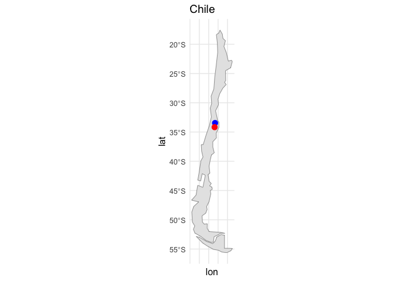
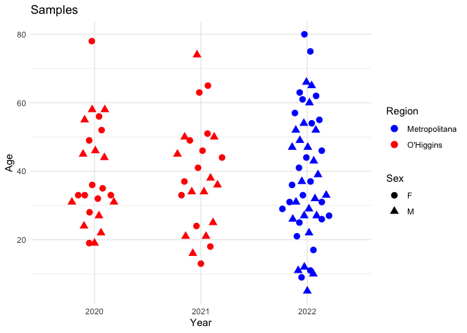
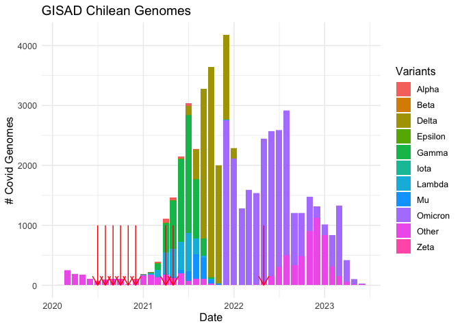
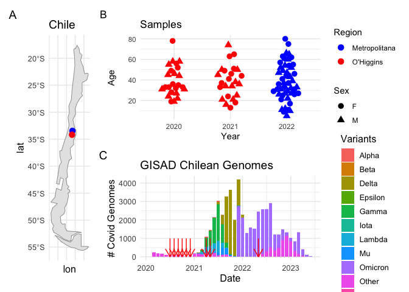
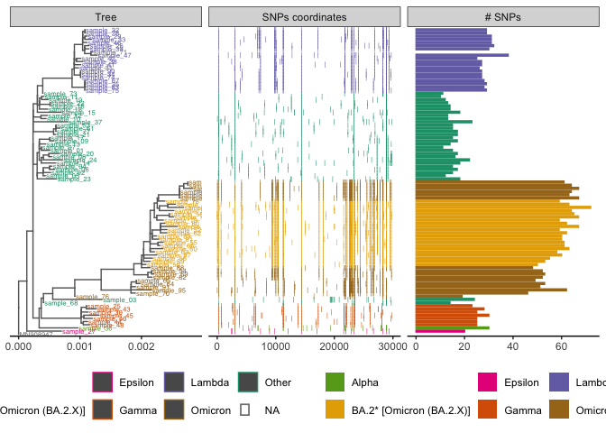
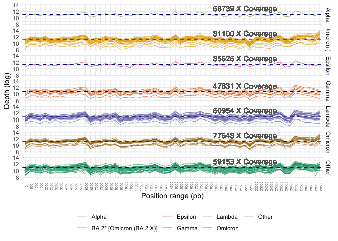
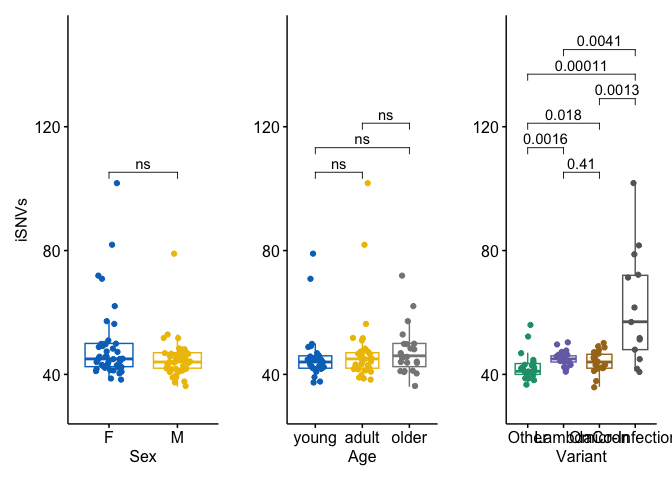
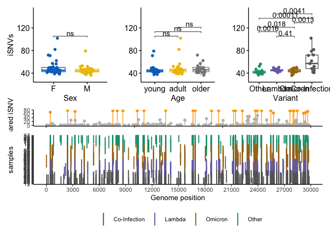
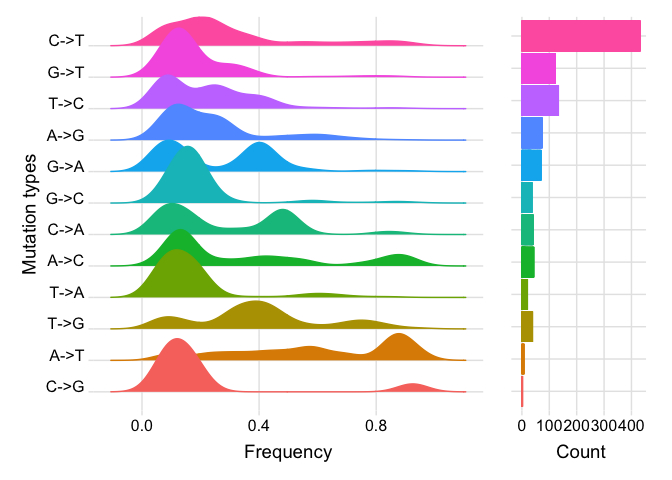
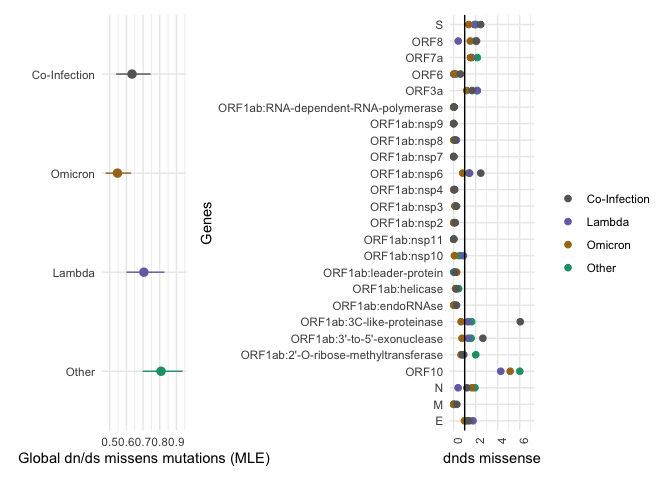

Covid Figures
================
Alex Di Genova
2024-05-06

# Figure 1

Demographic of sequenced COVID samples. \## Chilean map

Map of Chile hihglithing the Rancagua y Santiago regions
<!-- -->

## Demographic of samples

``` r
library(tidyverse)
```

    ## ── Attaching core tidyverse packages ──────────────────────── tidyverse 2.0.0 ──
    ## ✔ dplyr     1.1.4     ✔ readr     2.1.5
    ## ✔ forcats   1.0.0     ✔ stringr   1.5.1
    ## ✔ lubridate 1.9.3     ✔ tibble    3.2.1
    ## ✔ purrr     1.0.2     ✔ tidyr     1.3.1
    ## ── Conflicts ────────────────────────────────────────── tidyverse_conflicts() ──
    ## ✖ dplyr::filter() masks stats::filter()
    ## ✖ dplyr::lag()    masks stats::lag()
    ## ℹ Use the conflicted package (<http://conflicted.r-lib.org/>) to force all conflicts to become errors

``` r
df=read.table("../demographics/all_samples.txt", h=T)
dates_formatted <- as.Date(df$Date, format="%m/%d/%Y")
years <- format(dates_formatted, "%Y")
df$year=years
df=df %>% mutate(Ct=as.integer(Ct))
df$all="all"
```

we make the plot

``` r
library(tidyverse)
library(ggbeeswarm)
count_data <- df %>%
  group_by(year) %>%
  summarise(count = n())

p2=ggplot(df, aes(x = year, y = Age, )) +
     #geom_boxplot(aes(group = year), color="brown", alpha = 0.5) + # Add boxplot
  geom_quasirandom(aes(color = Region, shape = Sex),width = 0.25, height = 0, size=3) +
  # geom_beeswarm(aes(color = Region, shape = Sex),width = 0.25, height = 0, size=3) +
   #geom_jitter(, width = 0.2, height = 0) +
  scale_color_manual(values = c("Metropolitana" = "blue", "O'Higgins" = "red")) +
  labs(title = "Samples",
       x = "Year",
       y = "Age") +
    theme(text = element_text(size = 12)) +
  theme_minimal()
```

    ## Warning in geom_quasirandom(aes(color = Region, shape = Sex), width = 0.25, :
    ## Ignoring unknown parameters: `height`

``` r
p2
```

<!-- -->

``` r
# Ct plots 2.1
#ggplot(df, aes(x=all,shape=Sex,y=Ct,color=Region,group=all)) + geom_quasirandom() + theme_minimal()
# Ct plots 2.2
#ggplot(df, aes(x=Age,shape=Sex,y=Ct,color=Region,group=all)) + geom_point() + theme_minimal()
```

## GISAD

## Plotting number of samples and percentage of variants in Chile.

## Number of samples

Here we got the number of samples in Chile from GISAID platform, we
label this with their corresponding name of VOI or VOC. With blue arrows
we point out where our samples are located on the timeline. Around years
2021 and 2022 there is huge increase in the sequencing of COVID samples
in Chile.

<!-- -->

We compose all plots to generate figure 1

``` r
library(patchwork)

patchwork=p1|(p2/p3)  
patchwork + plot_annotation(tag_levels = 'A')
```

<!-- -->

``` r
pdf(file="Fig1.pdf",height=7,width=9)
patchwork + plot_annotation(tag_levels = 'A')
dev.off()
```

    ## quartz_off_screen 
    ##                 2

# Figure 2

Philogenetics, variants detected and coverage.

## Phylogenetic tree

We plot the tree including variants type, iVAR snp distribution and
number of SNPs

``` r
library(ggtree)

# Customize further as needed
p4 <- ggtree(x_new, color="grey40", ladderize = TRUE) +
  #xlim_tree(0.00325) +
  geom_tiplab(aes(color=variant, label = sampleId), size=2.) +
  scale_color_manual('', values = variant) +
  scale_fill_manual('', values = variant) +
  guides(color = guide_legend(override.aes = list(size = 5, label = "\u25AA")))+
  theme_tree2(legend.position = "bottom")

# add SNP data by position in the tree
p5= p4 + geom_facet(panel = "SNPs coordinates", data = ivdt_longer, geom = geom_point, 
               mapping=aes(x = pos,group=sampleId, color=variant,fill=variant), shape = '|') +
             geom_facet(panel = "# SNPs", data = ivar_c, geom = geom_col, 
                aes(x = value, color = variant, fill=variant), orientation = 'y', width = .6)
p5
```

<!-- -->

``` r
#facet_widths(p8, widths = c(2, 2, 1))
pdf(file="Fig2.pdf",height=7,width=9)
facet_widths(p5, widths = c(2, 2, 1))
```

    ## Warning in grid.Call.graphics(C_text, as.graphicsAnnot(x$label), x$x, x$y, :
    ## conversion failure on '▪' in 'mbcsToSbcs': dot substituted for <e2>

    ## Warning in grid.Call.graphics(C_text, as.graphicsAnnot(x$label), x$x, x$y, :
    ## conversion failure on '▪' in 'mbcsToSbcs': dot substituted for <96>

    ## Warning in grid.Call.graphics(C_text, as.graphicsAnnot(x$label), x$x, x$y, :
    ## conversion failure on '▪' in 'mbcsToSbcs': dot substituted for <aa>

    ## Warning in grid.Call.graphics(C_text, as.graphicsAnnot(x$label), x$x, x$y, :
    ## conversion failure on '▪' in 'mbcsToSbcs': dot substituted for <e2>

    ## Warning in grid.Call.graphics(C_text, as.graphicsAnnot(x$label), x$x, x$y, :
    ## conversion failure on '▪' in 'mbcsToSbcs': dot substituted for <96>

    ## Warning in grid.Call.graphics(C_text, as.graphicsAnnot(x$label), x$x, x$y, :
    ## conversion failure on '▪' in 'mbcsToSbcs': dot substituted for <aa>

    ## Warning in grid.Call.graphics(C_text, as.graphicsAnnot(x$label), x$x, x$y, :
    ## conversion failure on '▪' in 'mbcsToSbcs': dot substituted for <e2>

    ## Warning in grid.Call.graphics(C_text, as.graphicsAnnot(x$label), x$x, x$y, :
    ## conversion failure on '▪' in 'mbcsToSbcs': dot substituted for <96>

    ## Warning in grid.Call.graphics(C_text, as.graphicsAnnot(x$label), x$x, x$y, :
    ## conversion failure on '▪' in 'mbcsToSbcs': dot substituted for <aa>

    ## Warning in grid.Call.graphics(C_text, as.graphicsAnnot(x$label), x$x, x$y, :
    ## conversion failure on '▪' in 'mbcsToSbcs': dot substituted for <e2>

    ## Warning in grid.Call.graphics(C_text, as.graphicsAnnot(x$label), x$x, x$y, :
    ## conversion failure on '▪' in 'mbcsToSbcs': dot substituted for <96>

    ## Warning in grid.Call.graphics(C_text, as.graphicsAnnot(x$label), x$x, x$y, :
    ## conversion failure on '▪' in 'mbcsToSbcs': dot substituted for <aa>

    ## Warning in grid.Call.graphics(C_text, as.graphicsAnnot(x$label), x$x, x$y, :
    ## conversion failure on '▪' in 'mbcsToSbcs': dot substituted for <e2>

    ## Warning in grid.Call.graphics(C_text, as.graphicsAnnot(x$label), x$x, x$y, :
    ## conversion failure on '▪' in 'mbcsToSbcs': dot substituted for <96>

    ## Warning in grid.Call.graphics(C_text, as.graphicsAnnot(x$label), x$x, x$y, :
    ## conversion failure on '▪' in 'mbcsToSbcs': dot substituted for <aa>

    ## Warning in grid.Call.graphics(C_text, as.graphicsAnnot(x$label), x$x, x$y, :
    ## conversion failure on '▪' in 'mbcsToSbcs': dot substituted for <e2>

    ## Warning in grid.Call.graphics(C_text, as.graphicsAnnot(x$label), x$x, x$y, :
    ## conversion failure on '▪' in 'mbcsToSbcs': dot substituted for <96>

    ## Warning in grid.Call.graphics(C_text, as.graphicsAnnot(x$label), x$x, x$y, :
    ## conversion failure on '▪' in 'mbcsToSbcs': dot substituted for <aa>

    ## Warning in grid.Call.graphics(C_text, as.graphicsAnnot(x$label), x$x, x$y, :
    ## conversion failure on '▪' in 'mbcsToSbcs': dot substituted for <e2>

    ## Warning in grid.Call.graphics(C_text, as.graphicsAnnot(x$label), x$x, x$y, :
    ## conversion failure on '▪' in 'mbcsToSbcs': dot substituted for <96>

    ## Warning in grid.Call.graphics(C_text, as.graphicsAnnot(x$label), x$x, x$y, :
    ## conversion failure on '▪' in 'mbcsToSbcs': dot substituted for <aa>

    ## Warning in grid.Call.graphics(C_text, as.graphicsAnnot(x$label), x$x, x$y, :
    ## conversion failure on '▪' in 'mbcsToSbcs': dot substituted for <e2>

    ## Warning in grid.Call.graphics(C_text, as.graphicsAnnot(x$label), x$x, x$y, :
    ## conversion failure on '▪' in 'mbcsToSbcs': dot substituted for <96>

    ## Warning in grid.Call.graphics(C_text, as.graphicsAnnot(x$label), x$x, x$y, :
    ## conversion failure on '▪' in 'mbcsToSbcs': dot substituted for <aa>

    ## Warning in grid.Call.graphics(C_text, as.graphicsAnnot(x$label), x$x, x$y, :
    ## conversion failure on '▪' in 'mbcsToSbcs': dot substituted for <e2>

    ## Warning in grid.Call.graphics(C_text, as.graphicsAnnot(x$label), x$x, x$y, :
    ## conversion failure on '▪' in 'mbcsToSbcs': dot substituted for <96>

    ## Warning in grid.Call.graphics(C_text, as.graphicsAnnot(x$label), x$x, x$y, :
    ## conversion failure on '▪' in 'mbcsToSbcs': dot substituted for <aa>

    ## Warning in grid.Call.graphics(C_text, as.graphicsAnnot(x$label), x$x, x$y, :
    ## conversion failure on '▪' in 'mbcsToSbcs': dot substituted for <e2>

    ## Warning in grid.Call.graphics(C_text, as.graphicsAnnot(x$label), x$x, x$y, :
    ## conversion failure on '▪' in 'mbcsToSbcs': dot substituted for <96>

    ## Warning in grid.Call.graphics(C_text, as.graphicsAnnot(x$label), x$x, x$y, :
    ## conversion failure on '▪' in 'mbcsToSbcs': dot substituted for <aa>

    ## Warning in grid.Call.graphics(C_text, as.graphicsAnnot(x$label), x$x, x$y, :
    ## conversion failure on '▪' in 'mbcsToSbcs': dot substituted for <e2>

    ## Warning in grid.Call.graphics(C_text, as.graphicsAnnot(x$label), x$x, x$y, :
    ## conversion failure on '▪' in 'mbcsToSbcs': dot substituted for <96>

    ## Warning in grid.Call.graphics(C_text, as.graphicsAnnot(x$label), x$x, x$y, :
    ## conversion failure on '▪' in 'mbcsToSbcs': dot substituted for <aa>

    ## Warning in grid.Call.graphics(C_text, as.graphicsAnnot(x$label), x$x, x$y, :
    ## conversion failure on '▪' in 'mbcsToSbcs': dot substituted for <e2>

    ## Warning in grid.Call.graphics(C_text, as.graphicsAnnot(x$label), x$x, x$y, :
    ## conversion failure on '▪' in 'mbcsToSbcs': dot substituted for <96>

    ## Warning in grid.Call.graphics(C_text, as.graphicsAnnot(x$label), x$x, x$y, :
    ## conversion failure on '▪' in 'mbcsToSbcs': dot substituted for <aa>

    ## Warning in grid.Call.graphics(C_text, as.graphicsAnnot(x$label), x$x, x$y, :
    ## conversion failure on '▪' in 'mbcsToSbcs': dot substituted for <e2>

    ## Warning in grid.Call.graphics(C_text, as.graphicsAnnot(x$label), x$x, x$y, :
    ## conversion failure on '▪' in 'mbcsToSbcs': dot substituted for <96>

    ## Warning in grid.Call.graphics(C_text, as.graphicsAnnot(x$label), x$x, x$y, :
    ## conversion failure on '▪' in 'mbcsToSbcs': dot substituted for <aa>

    ## Warning in grid.Call.graphics(C_text, as.graphicsAnnot(x$label), x$x, x$y, :
    ## conversion failure on '▪' in 'mbcsToSbcs': dot substituted for <e2>

    ## Warning in grid.Call.graphics(C_text, as.graphicsAnnot(x$label), x$x, x$y, :
    ## conversion failure on '▪' in 'mbcsToSbcs': dot substituted for <96>

    ## Warning in grid.Call.graphics(C_text, as.graphicsAnnot(x$label), x$x, x$y, :
    ## conversion failure on '▪' in 'mbcsToSbcs': dot substituted for <aa>

``` r
dev.off()
```

    ## quartz_off_screen 
    ##                 2

# Figure 3

Genome coverage

## Samtools depth

Checking depth of the samples and separate them by variant and location.

``` r
suppressMessages(library('reshape2'))
samtools_results <-read.table('samtools_depth.csv', h=TRUE,sep=",")
samtools_results <- melt(samtools_results, id="X")
colnames(samtools_results) <- c('pos', 'sampleId', 'depth')

samtools_results <- left_join(samtools_results,all_results[c('sampleId', 'location', 'variant')], by="sampleId")
samtools_results<-samtools_results[!grepl("71", samtools_results$sample),]

samtools_results <- samtools_results %>% group_by(variant)

samtools_results <- samtools_results %>% group_by(variant) %>%
  mutate(med = mean(depth, na.rm = TRUE))

samtools_depth_range <- samtools_results %>%
  group_by(sampleId, grp = cut(pos, breaks=pretty(pos, n = 60), dig.lab = 5),  variant, med) %>% 
  summarise(count = mean(depth, na.rm = TRUE))
```

    ## `summarise()` has grouped output by 'sampleId', 'grp', 'variant'. You can
    ## override using the `.groups` argument.

### Samtools depth plot

    ## Warning: Using `size` aesthetic for lines was deprecated in ggplot2 3.4.0.
    ## ℹ Please use `linewidth` instead.
    ## This warning is displayed once every 8 hours.
    ## Call `lifecycle::last_lifecycle_warnings()` to see where this warning was
    ## generated.

    ## Warning: Removed 7 rows containing missing values (`geom_line()`).

<!-- -->

    ## Warning: Removed 7 rows containing missing values (`geom_line()`).

    ## quartz_off_screen 
    ##                 2

# Figure 4

Heterogeneity analysis

## SNVs

``` r
library(tidyverse)
csv_files <- list.files(pattern="*.variants.tsv",path = "../SNVs/")
l_data <- list()
for (file in csv_files) {
  data <- read.table(paste0("../SNVs/",file),h=T)
  #data <- data %>% filter(ALT_FREQ >=0.95)
  data$Filename <- file
  l_data[[file]] <- data
}
SNV_ivar <- bind_rows(l_data)
SNV_ivar$barcode=as.integer(str_extract(SNV_ivar$Filename,"(?<=-)\\d+"))
```

## iSNVs

loading a cleaning iSNV data, our filters include ALT_FREQ in \[0.05 to
0.95\], ALT_quality \> 30, ALT_DP \>100 as well as virus load \<= 28,
and no co-infection.

``` r
csv_files <- list.files(pattern="*_variants.tsv",path = "../iSNVs/")
filtered_data <- list()
for (file in csv_files) {
  data <- read.table(paste0("../iSNVs/",file),h=T)
  dataf=data %>% filter(ALT_DP >=100) %>% filter(PASS=="TRUE")%>% filter(ALT_FREQ >= 0.05 & ALT_FREQ<0.95 & ALT_QUAL > 30)
  dataf$Filename <- file
  filtered_data[[file]] <- dataf
}

iSNVs <- bind_rows(filtered_data)
iSNVs$barcode=as.integer(str_extract(iSNVs$Filename,"(?<=-)\\d+"))
#we remove all variants calls by ivar in the same sample/position
iSNVs=iSNVs %>% filter(!paste0(barcode,POS,ALT) %in% paste0(SNV_ivar$barcode,SNV_ivar$POS,SNV_ivar$ALT))

iSNVs_count = iSNVs %>%group_by(Filename) %>% count()
iSNVs_count$barcode=as.integer(str_extract(iSNVs_count$Filename,"(?<=-)\\d+"))
iSNV_data=left_join(iSNVs_count,df) %>% mutate(age2=if_else(Age < 30,"young",if_else(Age >=30 & Age<50,"adult","older")))
```

    ## Joining with `by = join_by(barcode)`

``` r
b=all_results %>% mutate(barcode=as.integer(str_extract(sampleId,"(?<=_)\\d+")))  %>% select(barcode,mut_ivar,variant)
iSNV_data=left_join(iSNV_data,b)
```

    ## Joining with `by = join_by(barcode)`

``` r
iSNV_data=iSNV_data %>% mutate(variant=if_else(variant=="BA.2* [Omicron (BA.2.X)]","Omicron",variant))

# Ct <= 28
iSNV_data=iSNV_data%>% filter(Ct<=28)
# filtro de Co-infection muestras con mayor de 3% de por mas de otra variante
ff=read.table("aggregated-freyja-parse.tsv",h=T,sep="\t")
fff=ff%>%filter(percentage*100 > 3) %>%select(file) %>% group_by(file) %>% count() %>% filter(n>1)
fff$barcode=as.integer(str_extract(fff$file,"(?<=-)\\d+"))
iSNV_coi=iSNV_data %>% filter(barcode %in% fff$barcode)
iSNV_data=iSNV_data %>% filter(!barcode %in% fff$barcode)
iSNV_coi$variant="Co-Infection"
iSNV_data=rbind(iSNV_data,iSNV_coi)
# load coverage data
gcov=read.table("resume_samtools_coverage.txt",h=T)
gcov=gcov %>% mutate(barcode=as.integer(str_extract(sname,"(?<=-)\\d+"))) %>% select(barcode,meandepth,coverage) %>%mutate(logc=log10(meandepth))
iSNV_data=left_join(iSNV_data,gcov)
```

    ## Joining with `by = join_by(barcode)`

``` r
iSNV_coi=left_join(iSNV_coi,gcov)
```

    ## Joining with `by = join_by(barcode)`

``` r
# we filter the iSNVs position relative to the samples filtered in the previos steps
iSNVs=iSNVs %>% filter(barcode %in% iSNV_data$barcode)
iSNVs=left_join(iSNVs,iSNV_data %>% select(barcode,variant,Sex,meandepth), by=c("barcode"="barcode"))
```

    ## Adding missing grouping variables: `Filename`

### Regression model

``` r
iSNVlm=lm(iSNV_data$n~iSNV_data$age2+iSNV_data$Sex
          +iSNV_data$mut_ivar+iSNV_data$variant)
summary(iSNVlm)
```

    ## 
    ## Call:
    ## lm(formula = iSNV_data$n ~ iSNV_data$age2 + iSNV_data$Sex + iSNV_data$mut_ivar + 
    ##     iSNV_data$variant)
    ## 
    ## Residuals:
    ##     Min      1Q  Median      3Q     Max 
    ## -22.429  -2.493  -0.049   2.453  38.655 
    ## 
    ## Coefficients:
    ##                               Estimate Std. Error t value Pr(>|t|)    
    ## (Intercept)                   48.12627    8.89775   5.409 7.67e-07 ***
    ## iSNV_data$age2older           -0.32401    2.16169  -0.150   0.8813    
    ## iSNV_data$age2young           -0.06983    2.13615  -0.033   0.9740    
    ## iSNV_data$SexM                -3.16241    1.78990  -1.767   0.0814 .  
    ## iSNV_data$mut_ivar             0.06787    0.11735   0.578   0.5648    
    ## iSNV_data$variantCo-Infection 11.96125    8.57549   1.395   0.1673    
    ## iSNV_data$variantEpsilon      -4.41387   11.71279  -0.377   0.7074    
    ## iSNV_data$variantGamma         0.50403    8.87734   0.057   0.9549    
    ## iSNV_data$variantLambda       -3.24751    8.31548  -0.391   0.6973    
    ## iSNV_data$variantOmicron      -6.16524    9.00606  -0.685   0.4958    
    ## iSNV_data$variantOther        -5.07744    8.43915  -0.602   0.5493    
    ## ---
    ## Signif. codes:  0 '***' 0.001 '**' 0.01 '*' 0.05 '.' 0.1 ' ' 1
    ## 
    ## Residual standard error: 7.96 on 73 degrees of freedom
    ## Multiple R-squared:  0.4525, Adjusted R-squared:  0.3774 
    ## F-statistic: 6.032 on 10 and 73 DF,  p-value: 1.305e-06

We test the mean between groups comparison according to values

``` r
# we start with the ones that are significant or relevants
library(ggpubr)
```

    ## 
    ## Attaching package: 'ggpubr'

    ## The following object is masked from 'package:ape':
    ## 
    ##     rotate

    ## The following object is masked from 'package:ggtree':
    ## 
    ##     rotate

``` r
library(patchwork)
## sex 
my_comparisons <- list( c("F", "M"))
sexp <- ggboxplot(iSNV_data, x = "Sex", y = "n",
          color = "Sex", palette = "jco",
          add = "jitter")
#  Add p-value
sexp= sexp  + stat_compare_means( comparisons = my_comparisons, aes(label = ..p.signif..)) + 
  labs(y="iSNVs") +
  ylim(30,150)+
  theme(legend.position = "none")

## variant with more than 10 cases
mvars=c("Lambda","Omicron","Other","Co-Infection")
iSNV_data_tmp=iSNV_data %>% filter(variant %in% mvars)
my_comparisons <- list(
  c("Lambda", "Omicron"), c("Other", "Lambda"), c("Omicron","Other"), c("Co-Infection","Omicron"),
  c("Co-Infection","Other"),c("Co-Infection","Lambda"))
varp=ggboxplot(iSNV_data_tmp, x = "variant", y = "n",
          color = "variant", palette = "jco", add = "jitter")+ 
  scale_color_manual('', values = variant) +
  stat_compare_means(comparisons = my_comparisons, exact = FALSE)+ # Add pairwise comparisons p-value
  #stat_compare_means(label.y = 80) + 
  labs(y="",x="Variant")    +ylim(30,150)+ theme(legend.position = "none")  # Add global p-value
```

    ## Scale for colour is already present.
    ## Adding another scale for colour, which will replace the existing scale.

``` r
##Age group comparison
my_comparisons <- list( c("young", "adult"), c("young", "older"), c("older", "adult") )
agep=ggboxplot(iSNV_data, x = "age2", y = "n",
          color = "age2", palette = "jco", add = "jitter")+ 
  #scale_color_manual('', values = variant) +
  stat_compare_means(comparisons = my_comparisons, exact = FALSE, aes(label = ..p.signif..))+ # Add pairwise comparisons p-value
 # stat_compare_means(label.y = 80) + 
  ylim(30,150)+labs(y="",x="Age")  + theme(legend.position = "none")   # Add global p-value

piSNVs<-sexp + agep + varp
piSNVs
```

    ## Warning in wilcox.test.default(c(43, 43, 40, 38, 42, 44, 41, 39, 42, 45, :
    ## cannot compute exact p-value with ties

    ## Warning in wilcox.test.default(c(43, 37, 41, 39, 44, 42, 45, 43, 41, 47, :
    ## cannot compute exact p-value with ties

    ## Warning in wilcox.test.default(c(43, 37, 41, 39, 44, 42, 45, 43, 41, 47, :
    ## cannot compute exact p-value with ties

    ## Warning in wilcox.test.default(c(40, 44, 41, 41, 47, 44, 41, 48, 50, 53, :
    ## cannot compute exact p-value with ties

    ## Warning in wilcox.test.default(c(43, 43, 37, 40, 38, 42, 52, 44, 41, 39, :
    ## cannot compute exact p-value with ties

    ## Warning in wilcox.test.default(c(45, 43, 41, 42, 42, 44, 44, 46, 44, 48, :
    ## cannot compute exact p-value with ties

    ## Warning in wilcox.test.default(c(46, 43, 43, 46, 49, 42, 44, 45, 36, 45, :
    ## cannot compute exact p-value with ties

    ## Warning in wilcox.test.default(c(45, 62, 52, 51, 41, 79, 82, 42, 72, 71, :
    ## cannot compute exact p-value with ties

    ## Warning in wilcox.test.default(c(45, 62, 52, 51, 41, 79, 82, 42, 72, 71, :
    ## cannot compute exact p-value with ties

    ## Warning in wilcox.test.default(c(45, 62, 52, 51, 41, 79, 82, 42, 72, 71, :
    ## cannot compute exact p-value with ties

<!-- -->

Distribution and impact plots

``` r
#library(gggenes)
#ggplot()+geom_gene_arrow(data=covid19_gene,aes(xmin=start,xmax=end,y=genome,fill=geneName))+scale_fill_brewer(palette = "Set3")+theme_genes()
# iSNVs%>% filter(variant %in% mvars) %>% ggplot(aes(x=POS,fill=variant))+
#   geom_histogram(binwidth=100,position="stack")+
#   scale_fill_manual('', values = variant) +
#   theme_classic()+
#   theme(legend.position = "bottom") + 
#   facet_grid(variant~.) +
#   labs(y="iSNVs")
```

alternative working with windows

``` r
# iSNVsw = transform(iSNVs, W = cut(iSNVs$POS,seq(0, 30000, 1000), labels = FALSE))
# wiSNVc = iSNVsw %>% group_by(W,barcode) %>% summarize(n=n())
# wiSNVc = left_join(wiSNVc,iSNV_data %>%select(barcode,variant),by=c("barcode"="barcode"))
# 
# wiSNVc = wiSNVc %>% filter(variant %in% mvars)
# 
# ggplot(wiSNVc, aes(x = factor(W), y = n, fill = variant,color=variant))+
#   #geom_boxplot(width=0.7, position=position_dodge(width = 0.7))+
#   geom_col(position=position_dodge())+
#   #ylim(0,6)+
#   theme_classic()

tmp=iSNVs %>% filter(variant %in% mvars) %>% select(barcode,variant) %>% unique() %>% arrange(variant)
tmp2=iSNVs %>% filter(variant %in% mvars)
tmp2$barcode=factor(tmp2$barcode,levels=tmp$barcode)

p2=tmp2 %>% ggplot(aes(x=POS,y=barcode,color=variant)) + geom_point(shape="|",size=7) +  scale_color_manual('', values = variant) +
  scale_x_continuous(breaks = seq(0,30000,3000)) +
  theme_classic() + labs(x="Genome position",y="samples") + theme(legend.position = "bottom")

#second plot with samples count

d=iSNVs %>% filter(variant %in% mvars) %>% select(POS,barcode) %>% group_by(POS,barcode) %>% unique() %>% group_by(POS) %>% summarize(n=n()) 
p3=d%>% ggplot(aes(x=POS,y=n)) + geom_point(color=ifelse(d$n > 61,"orange", "grey")) + geom_segment( aes(x=POS, xend=POS, y=0, yend=n), color=ifelse(d$n > 61,"orange", "grey")) +theme_classic() + labs(x="Genome position",y="shared iSNV") +  theme(axis.text.x = element_blank(),axis.title.x = element_blank())

patg<-p3/p2 +  plot_layout(heights = c(1,3))
piSNVs/patg
```

    ## Warning in wilcox.test.default(c(43, 43, 40, 38, 42, 44, 41, 39, 42, 45, :
    ## cannot compute exact p-value with ties

    ## Warning in wilcox.test.default(c(43, 37, 41, 39, 44, 42, 45, 43, 41, 47, :
    ## cannot compute exact p-value with ties

    ## Warning in wilcox.test.default(c(43, 37, 41, 39, 44, 42, 45, 43, 41, 47, :
    ## cannot compute exact p-value with ties

    ## Warning in wilcox.test.default(c(40, 44, 41, 41, 47, 44, 41, 48, 50, 53, :
    ## cannot compute exact p-value with ties

    ## Warning in wilcox.test.default(c(43, 43, 37, 40, 38, 42, 52, 44, 41, 39, :
    ## cannot compute exact p-value with ties

    ## Warning in wilcox.test.default(c(45, 43, 41, 42, 42, 44, 44, 46, 44, 48, :
    ## cannot compute exact p-value with ties

    ## Warning in wilcox.test.default(c(46, 43, 43, 46, 49, 42, 44, 45, 36, 45, :
    ## cannot compute exact p-value with ties

    ## Warning in wilcox.test.default(c(45, 62, 52, 51, 41, 79, 82, 42, 72, 71, :
    ## cannot compute exact p-value with ties

    ## Warning in wilcox.test.default(c(45, 62, 52, 51, 41, 79, 82, 42, 72, 71, :
    ## cannot compute exact p-value with ties

    ## Warning in wilcox.test.default(c(45, 62, 52, 51, 41, 79, 82, 42, 72, 71, :
    ## cannot compute exact p-value with ties

<!-- -->

Mutation types distribution and count

``` r
library(ggridges)
tmp=iSNVs %>% select("REGION","POS","REF", "ALT","ALT_FREQ") %>% mutate(allele=paste0(REF,"->",ALT))

tmp$allele=factor(tmp$allele,levels=names(sort(table(tmp$allele))))

p1=tmp %>% ggplot(aes(y=allele,x=ALT_FREQ,fill=allele,color=allele))  +  geom_density_ridges() + theme_ridges(center_axis_labels=TRUE) + theme(legend.position = "none") + labs(x="Frequency", y="Mutation types")

p2=tmp %>% ggplot(aes(y=allele,x=ALT_FREQ,fill=allele,color=allele))  +  geom_col() + theme_ridges(center_axis_labels=TRUE) + theme(legend.position = "none",axis.text.y = element_blank(),axis.title.y = element_blank()) + labs(x="Count") 

p1+p2 + plot_layout(widths = c(3,1))
```

    ## Picking joint bandwidth of 0.0521

<!-- -->

Mutation impact and Dn/Ds per gene in samples

### running dndscv on covid data

``` r
library(dndscv)
```

    ## Warning: replacing previous import 'Biostrings::translate' by
    ## 'seqinr::translate' when loading 'dndscv'

``` r
#sampleID chr      pos ref mut
names <- c(sampleID="barcode", chr="REGION", pos="POS",ref="REF",mut="ALT")
omicron=iSNVs %>% filter(variant=="Omicron") %>% select(barcode,REGION,POS,REF,ALT) %>% rename(all_of(names))
other=iSNVs %>% filter(variant=="Other") %>% select(barcode,REGION,POS,REF,ALT) %>% rename(all_of(names))
Lambda=iSNVs %>% filter(variant=="Lambda") %>% select(barcode,REGION,POS,REF,ALT) %>% rename(all_of(names))
Coi=iSNVs %>% filter(variant=="Co-Infection") %>% select(barcode,REGION,POS,REF,ALT) %>% rename(all_of(names))

# we run the dnds analisys 
dnds_omi = dndscv(omicron, refdb = "./dndscv/db/RefCDS_MN908947.3.peptides.rda", max_muts_per_gene_per_sample = Inf, max_coding_muts_per_sample = Inf)
```

    ## [1] Loading the environment...

    ## [2] Annotating the mutations...

    ## Warning in dndscv(omicron, refdb =
    ## "./dndscv/db/RefCDS_MN908947.3.peptides.rda", : Mutations observed in
    ## contiguous sites within a sample. Please annotate or remove dinucleotide or
    ## complex substitutions for best results.

    ## Warning in dndscv(omicron, refdb =
    ## "./dndscv/db/RefCDS_MN908947.3.peptides.rda", : Same mutations observed in
    ## different sampleIDs. Please verify that these are independent events and remove
    ## duplicates otherwise.

    ## [3] Estimating global rates...

    ## [4] Running dNdSloc...

    ## [5] Running dNdScv...

    ##     Regression model for substitutions (theta = 0.554).

``` r
dnds_oth = dndscv(other, refdb = "./dndscv/db/RefCDS_MN908947.3.peptides.rda", max_muts_per_gene_per_sample = Inf, max_coding_muts_per_sample = Inf)
```

    ## [1] Loading the environment...

    ## [2] Annotating the mutations...

    ## Warning in dndscv(other, refdb = "./dndscv/db/RefCDS_MN908947.3.peptides.rda",
    ## : Same mutations observed in different sampleIDs. Please verify that these are
    ## independent events and remove duplicates otherwise.

    ## [3] Estimating global rates...

    ## [4] Running dNdSloc...

    ## [5] Running dNdScv...

    ## Warning in theta.ml(Y, mu, sum(w), w, limit = control$maxit, trace =
    ## control$trace > : iteration limit reached

    ## Warning in sqrt(1/i): NaNs produced

    ## Warning in theta.ml(Y, mu, sum(w), w, limit = control$maxit, trace =
    ## control$trace > : iteration limit reached

    ## Warning in sqrt(1/i): NaNs produced

    ##     Regression model for substitutions (theta = 1.7e+05).

``` r
dnds_lam = dndscv(Lambda, refdb = "./dndscv/db/RefCDS_MN908947.3.peptides.rda", max_muts_per_gene_per_sample = Inf, max_coding_muts_per_sample = Inf)
```

    ## [1] Loading the environment...

    ## [2] Annotating the mutations...

    ## Warning in dndscv(Lambda, refdb = "./dndscv/db/RefCDS_MN908947.3.peptides.rda",
    ## : Mutations observed in contiguous sites within a sample. Please annotate or
    ## remove dinucleotide or complex substitutions for best results.

    ## Warning in dndscv(Lambda, refdb = "./dndscv/db/RefCDS_MN908947.3.peptides.rda",
    ## : Same mutations observed in different sampleIDs. Please verify that these are
    ## independent events and remove duplicates otherwise.

    ## [3] Estimating global rates...

    ## [4] Running dNdSloc...

    ## [5] Running dNdScv...

    ##     Regression model for substitutions (theta = 0.407).

``` r
dnds_coi = dndscv(Coi, refdb = "./dndscv/db/RefCDS_MN908947.3.peptides.rda", max_muts_per_gene_per_sample = Inf, max_coding_muts_per_sample = Inf)
```

    ## [1] Loading the environment...

    ## [2] Annotating the mutations...

    ## Warning in dndscv(Coi, refdb = "./dndscv/db/RefCDS_MN908947.3.peptides.rda", :
    ## Mutations observed in contiguous sites within a sample. Please annotate or
    ## remove dinucleotide or complex substitutions for best results.

    ## Warning in dndscv(Coi, refdb = "./dndscv/db/RefCDS_MN908947.3.peptides.rda", :
    ## Same mutations observed in different sampleIDs. Please verify that these are
    ## independent events and remove duplicates otherwise.

    ## [3] Estimating global rates...

    ## [4] Running dNdSloc...

    ## [5] Running dNdScv...

    ##     Regression model for substitutions (theta = 1.06).

``` r
a=dnds_oth$sel_cv %>% select(gene_name,wmis_cv) %>% mutate(var="Other")
b=dnds_lam$sel_cv %>% select(gene_name,wmis_cv) %>% mutate(var="Lambda")
c=dnds_omi$sel_cv %>% select(gene_name,wmis_cv) %>% mutate(var="Omicron")
d=dnds_coi$sel_cv %>% select(gene_name,wmis_cv) %>% mutate(var="Co-Infection")

bb=rbind(a,b,c,d) %>% ggplot(aes(y=gene_name,x=wmis_cv,color=var,group=var))  + geom_point(size=2)+ 
   geom_vline(xintercept = 1) +labs(y="Genes",x="dnds missense")+ xlim(0,7)+
  #coord_flip()+
  scale_color_manual('', values = variant) +
  theme_minimal() + theme(axis.text.x = element_text(angle = 90))


global_dnds=rbind(dnds_oth$globaldnds[1,],
                  dnds_lam$globaldnds[1,],
                  dnds_omi$globaldnds[1,],
                  dnds_coi$globaldnds[1,])
global_dnds$name=c("Other","Lambda","Omicron","Co-Infection")
global_dnds$name=factor(global_dnds$name,levels=c("Other","Lambda","Omicron","Co-Infection"))
cc=global_dnds %>% ggplot(aes(x=name,y=mle,color=name)) + geom_point() + geom_pointrange(aes(ymin = cilow, ymax = cihigh)) +scale_color_manual('', values = variant) + theme_minimal() + labs(y="Global dn/ds missens mutations (MLE)",x="") + coord_flip() +theme(legend.position = "none") 

cc|bb
```

    ## Warning: Removed 3 rows containing missing values (`geom_point()`).

<!-- -->

``` r
#sel_cv  %>% select(gene_name, n_syn, n_mis) %>% pivot_longer(-gene_name) %>% ggplot(aes(y=gene_name,x=value/23,fill=name)) + geom_col(position = position_dodge())
# dnds_omi$sel_cv %>% ggplot(aes(y=gene_name,x=wmis_cv)) + geom_point() + geom_segment( aes(x=wmis_cv, xend=wmis_cv, y=gene_name, yend=gene_name))
# dnds_oth$sel_cv %>% ggplot(aes(y=gene_name,x=wmis_cv)) + geom_point() + geom_segment( aes(x=wmis_cv, xend=wmis_cv, y=gene_name, yend=gene_name))
# dnds_lam$sel_cv %>% ggplot(aes(y=gene_name,x=wmis_cv)) + geom_point() + geom_segment( aes(x=wmis_cv, xend=wmis_cv, y=gene_name, yend=gene_name))
```
