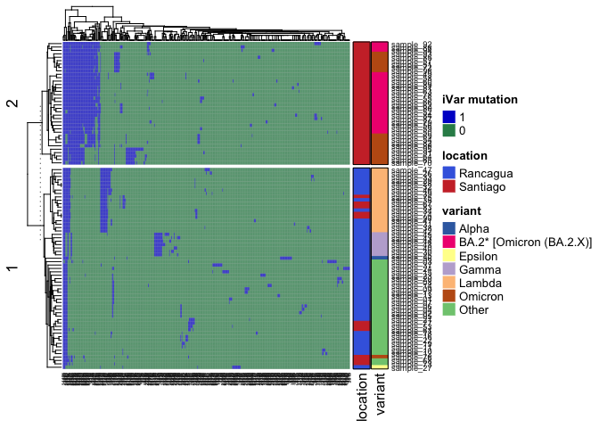
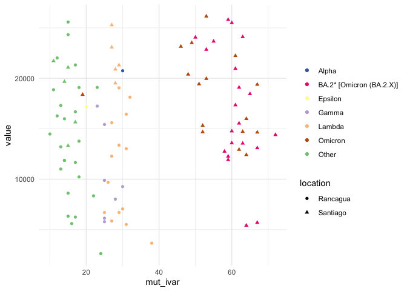
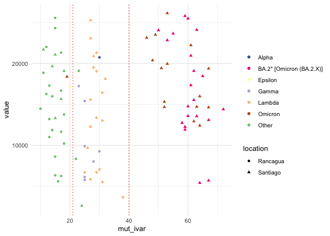
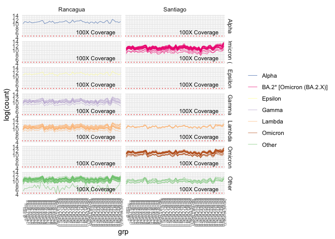

analysis_covid
================
2023-08-08

## Reading files

Reading results from iVar and freya from join_flow_cell pipeline and
including demographic information of samples.

    ## Using X as id variables

## Results

### Mutation Heatmap

Using ComplexHeatmap library to plot if samples has 1 or any mutations
detected by iVar, using a binary matrix. Variant a location is also
included into the heatmap.

<!-- -->

### Number of variants vs heterogeneity

Combining mutations detected by iVar and variations in to positions
detected by Freya. Including variant information and location of
samples.

<!-- -->

### Heterogeneity between groups

In the previous there are three identifiable groups in the samples. Here
is the analysis to check if in every variant posible in the genome and
detected genes that are most mutated in the samples.

#### Groups:

    ## Warning: Using `size` aesthetic for lines was deprecated in ggplot2 3.4.0.
    ## ℹ Please use `linewidth` instead.
    ## This warning is displayed once every 8 hours.
    ## Call `lifecycle::last_lifecycle_warnings()` to see where this warning was
    ## generated.

<!-- -->

\##Samtools depth

Checking depth of the samples and separate them by variant and location

    ## `summarise()` has grouped output by 'sampleId', 'grp', 'location'. You can
    ## override using the `.groups` argument.

### Samtools depth plot

<!-- -->
