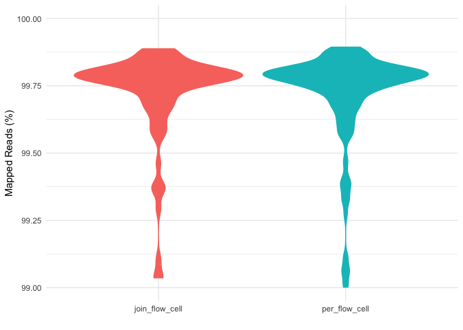
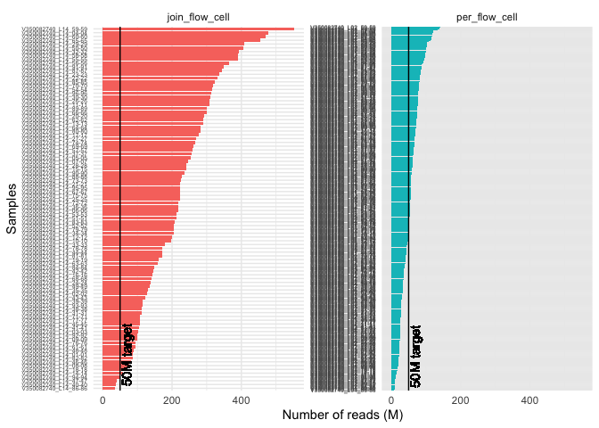
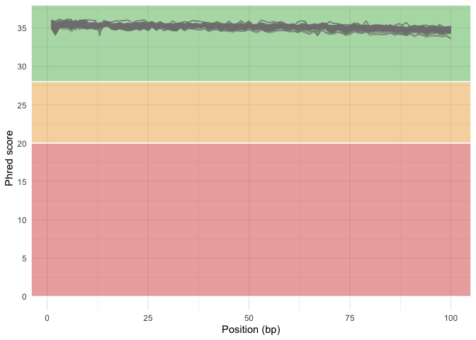
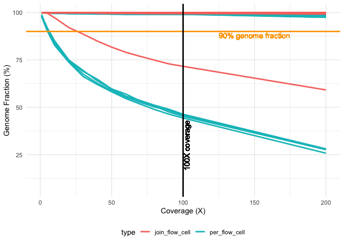
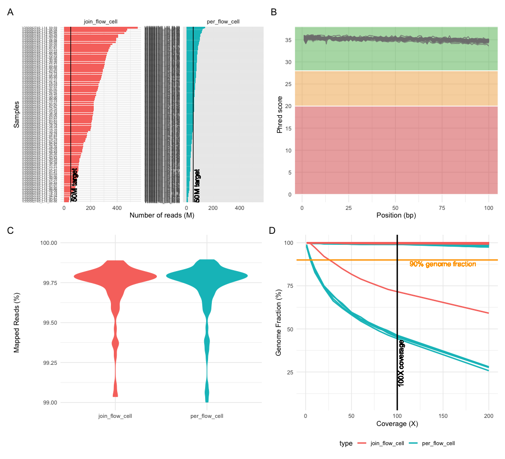

qc_covid_genomics
================
2023-08-03

## Reads Mapped

### Read mapped plot

violin plot from 99 to 100%.

    ## Warning: Removed 80 rows containing non-finite values (`stat_ydensity()`).

    ## Warning: The following aesthetics were dropped during statistical transformation: label
    ## ℹ This can happen when ggplot fails to infer the correct grouping structure in
    ##   the data.
    ## ℹ Did you forget to specify a `group` aesthetic or to convert a numerical
    ##   variable into a factor?

<!-- -->

### Number of reads and duplicates plot

<!-- -->

## sequence quality score

### Classic plot of quality score

<!-- -->

## Cumulative genome coverage

Percentage of the reference genome with at least the given depth of
coverage.

### Genome coverage plot

    ## Warning: Using `size` aesthetic for lines was deprecated in ggplot2 3.4.0.
    ## ℹ Please use `linewidth` instead.
    ## This warning is displayed once every 8 hours.
    ## Call `lifecycle::last_lifecycle_warnings()` to see where this warning was
    ## generated.

    ## Warning: Removed 3840 rows containing missing values (`geom_line()`).

<!-- -->

## Merge Plots

Merging all plots into one figure.

    ## Warning: Removed 80 rows containing non-finite values (`stat_ydensity()`).

    ## Warning: The following aesthetics were dropped during statistical transformation: label
    ## ℹ This can happen when ggplot fails to infer the correct grouping structure in
    ##   the data.
    ## ℹ Did you forget to specify a `group` aesthetic or to convert a numerical
    ##   variable into a factor?

    ## Warning: Removed 3840 rows containing missing values (`geom_line()`).

    ## quartz_off_screen 
    ##                 2

    ## Warning: Removed 80 rows containing non-finite values (`stat_ydensity()`).

    ## Warning: The following aesthetics were dropped during statistical transformation: label
    ## ℹ This can happen when ggplot fails to infer the correct grouping structure in
    ##   the data.
    ## ℹ Did you forget to specify a `group` aesthetic or to convert a numerical
    ##   variable into a factor?

    ## Warning: Removed 3840 rows containing missing values (`geom_line()`).

<!-- -->

## R session info

print the session information.

``` r
devtools::session_info()
```

    ## ─ Session info ───────────────────────────────────────────────────────────────
    ##  setting  value
    ##  version  R version 4.2.2 (2022-10-31)
    ##  os       macOS Monterey 12.4
    ##  system   aarch64, darwin20
    ##  ui       X11
    ##  language (EN)
    ##  collate  en_US.UTF-8
    ##  ctype    en_US.UTF-8
    ##  tz       America/Santiago
    ##  date     2023-08-03
    ##  pandoc   3.1.1 @ /Applications/RStudio.app/Contents/Resources/app/quarto/bin/tools/ (via rmarkdown)
    ## 
    ## ─ Packages ───────────────────────────────────────────────────────────────────
    ##  package     * version date (UTC) lib source
    ##  beeswarm      0.4.0   2021-06-01 [1] CRAN (R 4.2.0)
    ##  cachem        1.0.7   2023-02-24 [1] CRAN (R 4.2.0)
    ##  callr         3.7.3   2022-11-02 [1] CRAN (R 4.2.0)
    ##  cli           3.6.0   2023-01-09 [1] CRAN (R 4.2.0)
    ##  colorspace    2.0-3   2022-02-21 [1] CRAN (R 4.2.0)
    ##  crayon        1.5.2   2022-09-29 [1] CRAN (R 4.2.0)
    ##  devtools      2.4.5   2022-10-11 [1] CRAN (R 4.2.0)
    ##  digest        0.6.31  2022-12-11 [1] CRAN (R 4.2.0)
    ##  dplyr       * 1.1.2   2023-04-20 [1] CRAN (R 4.2.0)
    ##  ellipsis      0.3.2   2021-04-29 [1] CRAN (R 4.2.0)
    ##  evaluate      0.20    2023-01-17 [1] CRAN (R 4.2.0)
    ##  fansi         1.0.3   2022-03-24 [1] CRAN (R 4.2.0)
    ##  farver        2.1.1   2022-07-06 [1] CRAN (R 4.2.0)
    ##  fastmap       1.1.1   2023-02-24 [1] CRAN (R 4.2.0)
    ##  forcats     * 1.0.0   2023-01-29 [1] CRAN (R 4.2.0)
    ##  fs            1.6.1   2023-02-06 [1] CRAN (R 4.2.0)
    ##  generics      0.1.3   2022-07-05 [1] CRAN (R 4.2.0)
    ##  ggbeeswarm  * 0.7.1   2022-12-16 [1] CRAN (R 4.2.0)
    ##  ggplot2     * 3.4.2   2023-04-03 [1] CRAN (R 4.2.0)
    ##  glue          1.6.2   2022-02-24 [1] CRAN (R 4.2.0)
    ##  gtable        0.3.1   2022-09-01 [1] CRAN (R 4.2.0)
    ##  highr         0.10    2022-12-22 [1] CRAN (R 4.2.0)
    ##  hms           1.1.3   2023-03-21 [1] CRAN (R 4.2.0)
    ##  htmltools     0.5.4   2022-12-07 [1] CRAN (R 4.2.0)
    ##  htmlwidgets   1.6.2   2023-03-17 [1] CRAN (R 4.2.0)
    ##  httpuv        1.6.9   2023-02-14 [1] CRAN (R 4.2.0)
    ##  knitr         1.42    2023-01-25 [1] CRAN (R 4.2.0)
    ##  labeling      0.4.2   2020-10-20 [1] CRAN (R 4.2.0)
    ##  later         1.3.0   2021-08-18 [1] CRAN (R 4.2.0)
    ##  lifecycle     1.0.3   2022-10-07 [1] CRAN (R 4.2.0)
    ##  lubridate   * 1.9.2   2023-02-10 [1] CRAN (R 4.2.0)
    ##  magrittr      2.0.3   2022-03-30 [1] CRAN (R 4.2.0)
    ##  memoise       2.0.1   2021-11-26 [1] CRAN (R 4.2.0)
    ##  mime          0.12    2021-09-28 [1] CRAN (R 4.2.0)
    ##  miniUI        0.1.1.1 2018-05-18 [1] CRAN (R 4.2.0)
    ##  munsell       0.5.0   2018-06-12 [1] CRAN (R 4.2.0)
    ##  openxlsx    * 4.2.5.2 2023-02-06 [1] CRAN (R 4.2.0)
    ##  patchwork   * 1.1.2   2022-08-19 [1] CRAN (R 4.2.0)
    ##  pillar        1.9.0   2023-03-22 [1] CRAN (R 4.2.0)
    ##  pkgbuild      1.4.0   2022-11-27 [1] CRAN (R 4.2.0)
    ##  pkgconfig     2.0.3   2019-09-22 [1] CRAN (R 4.2.0)
    ##  pkgload       1.3.2   2022-11-16 [1] CRAN (R 4.2.0)
    ##  prettyunits   1.1.1   2020-01-24 [1] CRAN (R 4.2.0)
    ##  processx      3.8.0   2022-10-26 [1] CRAN (R 4.2.0)
    ##  profvis       0.3.7   2020-11-02 [1] CRAN (R 4.2.0)
    ##  promises      1.2.0.1 2021-02-11 [1] CRAN (R 4.2.0)
    ##  ps            1.7.2   2022-10-26 [1] CRAN (R 4.2.0)
    ##  purrr       * 1.0.1   2023-01-10 [1] CRAN (R 4.2.0)
    ##  R6            2.5.1   2021-08-19 [1] CRAN (R 4.2.0)
    ##  Rcpp          1.0.9   2022-07-08 [1] CRAN (R 4.2.0)
    ##  readr       * 2.1.4   2023-02-10 [1] CRAN (R 4.2.0)
    ##  remotes       2.4.2   2021-11-30 [1] CRAN (R 4.2.0)
    ##  rlang         1.1.0   2023-03-14 [1] CRAN (R 4.2.0)
    ##  rmarkdown     2.23    2023-07-01 [1] CRAN (R 4.2.0)
    ##  rstudioapi    0.14    2022-08-22 [1] CRAN (R 4.2.0)
    ##  scales        1.2.1   2022-08-20 [1] CRAN (R 4.2.0)
    ##  sessioninfo   1.2.2   2021-12-06 [1] CRAN (R 4.2.0)
    ##  shiny         1.7.4   2022-12-15 [1] CRAN (R 4.2.0)
    ##  stringi       1.7.8   2022-07-11 [1] CRAN (R 4.2.0)
    ##  stringr     * 1.5.0   2022-12-02 [1] CRAN (R 4.2.0)
    ##  tibble      * 3.2.1   2023-03-20 [1] CRAN (R 4.2.0)
    ##  tidyr       * 1.3.0   2023-01-24 [1] CRAN (R 4.2.0)
    ##  tidyselect    1.2.0   2022-10-10 [1] CRAN (R 4.2.0)
    ##  tidyverse   * 2.0.0   2023-02-22 [1] CRAN (R 4.2.0)
    ##  timechange    0.1.1   2022-11-04 [1] CRAN (R 4.2.0)
    ##  tzdb          0.3.0   2022-03-28 [1] CRAN (R 4.2.0)
    ##  urlchecker    1.0.1   2021-11-30 [1] CRAN (R 4.2.0)
    ##  usethis       2.1.6   2022-05-25 [1] CRAN (R 4.2.0)
    ##  utf8          1.2.2   2021-07-24 [1] CRAN (R 4.2.0)
    ##  vctrs         0.6.2   2023-04-19 [1] CRAN (R 4.2.0)
    ##  vipor         0.4.5   2017-03-22 [1] CRAN (R 4.2.0)
    ##  withr         2.5.0   2022-03-03 [1] CRAN (R 4.2.0)
    ##  xfun          0.38    2023-03-24 [1] CRAN (R 4.2.0)
    ##  xtable        1.8-4   2019-04-21 [1] CRAN (R 4.2.0)
    ##  yaml          2.3.7   2023-01-23 [1] CRAN (R 4.2.0)
    ##  zip           2.2.2   2022-10-26 [1] CRAN (R 4.2.0)
    ## 
    ##  [1] /Library/Frameworks/R.framework/Versions/4.2-arm64/Resources/library
    ## 
    ## ──────────────────────────────────────────────────────────────────────────────
